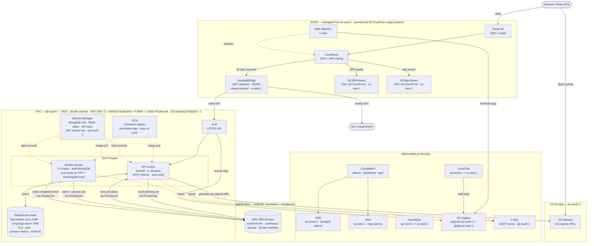

# Infrastructure cost estimate — production (ap-south-1)

Launch-day services only. Single region, 1,000 to 10 million users. Deferred services are listed at the end for reference.

All figures in USD/month, ap-south-1 on-demand rates (June 2026).

---

## Architecture diagram



---

## Summary

| Scenario | Monthly | Annual |
|---|---|---|
| dev/sbx (steady-state baseline) | ~$157 | ~$1,884 |
| stg (steady-state baseline) | ~$566 | ~$6,792 |
| prod — 1,000 users (1 API + 1 worker task, M30, t4g.medium×2) | ~$986 | ~$11,832 |
| prod — 10,000 users (1 API + 1 worker task, M30, t4g.medium×2) | ~$996 | ~$11,952 |
| prod — 100,000 users (2 API + 1 worker tasks, M30, t4g.medium×2) | ~$1,120 | ~$13,440 |
| prod — 1 million users (5 API + 2 worker tasks, M40, m7g.large×2) | ~$2,170 | ~$26,040 |
| prod — 1 million users (peak burst, 20 API + 10 worker tasks sustained, M40) | ~$3,590 | — |
| prod — 10 million users (20 API + 10 worker tasks avg, M50, m7g.large×6) | ~$7,110 | ~$85,320 |

---

## Compute — ECS Fargate

| Service | dev/sbx | stg | prod(1K) | prod(10K) | prod(100K) | prod(1M) | prod(10M) |
|---|---|---|---|---|---|---|---|
| ECS Fargate — API service (5 baseline → 50 max hard limit, 2 vCPU / 4 GB each; cost estimate assumes 20 tasks avg at 10M users) | $9 | $75 | $75 | $75 | $149 | $373 | $1,494 |
| ECS Fargate — worker service (2 baseline → 10 max, 1 vCPU / 2 GB each; polls MongoDB jobs collection) | $9 | $19 | $37 | $37 | $37 | $75 | $374 |
| **Subtotal** | **$18** | **$94** | **$112** | **$112** | **$186** | **$448** | **$1,868** |

---

## Database — MongoDB Atlas

| Service | dev/sbx | stg | prod(1K) | prod(10K) | prod(100K) | prod(1M) | prod(10M) |
|---|---|---|---|---|---|---|---|
| Primary cluster — M10 at dev/sbx ($0.08/hr); M20 at stg ($0.20/hr); M30 at 1K–100K users (8 GB RAM, ~700 connections, $0.54/hr); M40 at 1M users (16 GB RAM, ~3K connections, $1.04/hr); M50 at 10M users (32 GB RAM, ~3K connections, $2.00/hr, hard cap) | $58 | $144 | $389 | $389 | $389 | $749 | $1,440 |
| **Subtotal** | **$58** | **$144** | **$389** | **$389** | **$389** | **$749** | **$1,440** |

> Atlas tier progression: M30 covers 1K–100K users comfortably (8 GB RAM, connection pool of ~50 API + ~10 worker tasks well within limits). Upgrade to M40 before 1M users to gain 16 GB RAM headroom ($1.04/hr, corrected rate). M50 (hard cap) is provisioned at 10M users at $2.00/hr (corrected rate) — architecture is capped here; M60 exists in Atlas but will not be used. At 10M-user load, connection pooling (~150 total connections) remains well within M50's ~3K limit.

---

## Caching — ElastiCache Redis

| Service | dev/sbx | stg | prod(1K) | prod(10K) | prod(100K) | prod(1M) | prod(10M) |
|---|---|---|---|---|---|---|---|
| Redis tier progression: dev/sbx — t4g.micro × 1 (burstable, 0.5 GB, dev/sbx only); stg — t4g.medium × 1 (3.09 GB, no replica — stg downtime acceptable); prod(1K–100K) — t4g.medium × 2 (primary+replica, multi-AZ); prod(1M) — m7g.large × 2 (non-burstable, 6.38 GB/node); prod(10M) — m7g.large × 6 (3 shards × 2 nodes, cluster mode — requires destroy+create from non-cluster). Upgrade from t4g.medium to m7g.large before 1M users: monitor `FreeableMemory` (alert below 500 MB) and `EngineCPUUtilization` (alert above 80%) in CloudWatch. | $14 | $58 | $117 | $117 | $117 | $236 | $709 |
| **Subtotal** | **$14** | **$58** | **$117** | **$117** | **$117** | **$236** | **$709** |

---

## Networking

| Service | dev/sbx | stg | prod(1K) | prod(10K) | prod(100K) | prod(1M) | prod(10M) |
|---|---|---|---|---|---|---|---|
| ALB | $17 | $20 | $20 | $20 | $21 | $23 | $36 |
| NAT Gateway — 3 AZs ($0.056/hr each) | $40 | $81 | $121 | $121 | $121 | $121 | $141 |
| VPC Interface Endpoints — 5 AWS services × AZ count ($0.013/AZ/hr each; ECR API, ECR DKR, Secrets Manager, CloudWatch Logs, X-Ray; skipped in dev/sbx; 2 AZs in stg; 3 AZs in prod) | — | $94 | $140 | $140 | $140 | $140 | $140 |
| Atlas PrivateLink VPC endpoint — 3 AZs ($0.013/AZ/hr; MongoDB traffic never traverses NAT GW; saves NAT data-processing charges on all Atlas query/response bytes) | — | $19 | $28 | $28 | $28 | $28 | $28 |
| CloudFront + WAF (scales with request volume; WAF fixed = $5 WebACL + 4 rules×$1 = $9/mo for stg/prod; request charges at $0.60/million) | $3 | $10 | $9 | $12 | $27 | $99 | $459 |
| **Subtotal** | **$60** | **$224** | **$318** | **$321** | **$337** | **$411** | **$804** |

---

## Security

| Service | dev/sbx | stg | prod(1K) | prod(10K) | prod(100K) | prod(1M) | prod(10M) |
|---|---|---|---|---|---|---|---|
| GuardDuty + ECS Runtime Monitoring (ap-south-1 + us-east-1, two detectors) | — | $20 | $20 | $22 | $25 | $55 | $160 |
| CloudTrail (ap-south-1 + us-east-1, two trails) | — | $2 | $2 | $2 | $3 | $4 | $6 |
| Lambda@Edge — JWT validation ($0.60 per 1M invocations + ~$0.02/1M duration at 128MB/3ms; assumes ~10 API calls/user/day; corrected from prior 10× underestimate at 100K+ users) | ~$0 | $1 | ~$0 | $2 | $19 | $186 | $1,860 |
| **Subtotal** | **$0** | **$23** | **$22** | **$26** | **$47** | **$245** | **$2,026** |

---

## Observability

| Service | dev/sbx | stg | prod(1K) | prod(10K) | prod(100K) | prod(1M) | prod(10M) |
|---|---|---|---|---|---|---|---|
| CloudWatch — logs, alarms, dashboards | $2 | $10 | $10 | $12 | $20 | $40 | $120 |
| AWS X-Ray + ADOT sidecar | $1 | $3 | $2 | $3 | $5 | $10 | $40 |
| SNS — alerts topic + email subscription | $1 | $1 | $1 | $1 | $1 | $2 | $2 |
| Kinesis Firehose — WAF log delivery to S3 (us-east-1) | — | — | $2 | $2 | $2 | $5 | $15 |
| **Subtotal** | **$4** | **$14** | **$15** | **$18** | **$28** | **$57** | **$177** |

---

## Storage — S3

| Service | dev/sbx | stg | prod(1K) | prod(10K) | prod(100K) | prod(1M) | prod(10M) |
|---|---|---|---|---|---|---|---|
| S3 — SPA assets (OAC-restricted, CloudFront reads only; in us-east-1) | $1 | $2 | $3 | $3 | $3 | $3 | $5 |
| S3 — app assets (static files served via CloudFront; OAC-restricted; in us-east-1) | $1 | $2 | $2 | $2 | $2 | $2 | $5 |
| S3 — user uploads (write access from ECS tasks via pre-signed URLs; in ap-south-1) | $1 | $3 | $3 | $3 | $5 | $7 | $45 |
| S3 — regional logging bucket (ALB logs, CloudTrail ap-south-1) | — | $2 | $3 | $3 | $3 | $5 | $15 |
| S3 — global logging bucket (CloudFront logs, WAF logs, CloudTrail us-east-1; must be us-east-1) | — | — | $2 | $2 | $2 | $5 | $15 |
| **Subtotal** | **$3** | **$9** | **$13** | **$13** | **$15** | **$22** | **$85** |

---

## Grand total — all environments

| Category | dev/sbx | stg | prod(1K) | prod(10K) | prod(100K) | prod(1M) | prod(10M) |
|---|---|---|---|---|---|---|---|
| Compute (API + worker) | $18 | $94 | $112 | $112 | $186 | $448 | $1,868 |
| Database (Atlas) | $58 | $144 | $389 | $389 | $389 | $749 | $1,440 |
| Cache (Redis) | $14 | $58 | $117 | $117 | $117 | $236 | $709 |
| Networking | $60 | $224 | $318 | $321 | $337 | $411 | $804 |
| Security | $0 | $23 | $22 | $26 | $47 | $245 | $2,026 |
| Observability | $4 | $14 | $15 | $18 | $28 | $57 | $177 |
| Storage | $3 | $9 | $13 | $13 | $15 | $22 | $85 |
| **Total** | **~$157** | **~$566** | **~$986** | **~$996** | **~$1,120** | **~$2,170** | **~$7,110** |

---

## Environment cost estimates

Cost per environment and user-scale tier at steady-state baseline (minimum task counts, no burst). All figures USD/month. **dev/sbx** are sized identically — sbx is a separate isolated sandbox that shares the same Terraform configuration as dev. Prod uses the same infrastructure configuration at all user scales; only autoscaled task count and traffic-driven costs change.

| Category | dev/sbx | stg | prod(1K) | prod(10K) | prod(100K) | prod(1M) | prod(10M) |
|---|---|---|---|---|---|---|---|
| Compute (ECS API + worker) | $18 | $94 | $112 | $112 | $186 | $448 | $1,868 |
| Database (Atlas) | $58 | $144 | $389 | $389 | $389 | $749 | $1,440 |
| Cache (Redis) | $14 | $58 | $117 | $117 | $117 | $236 | $709 |
| Networking | $60 | $224 | $318 | $321 | $337 | $411 | $804 |
| Security | $0 | $23 | $22 | $26 | $47 | $245 | $2,026 |
| Observability | $4 | $14 | $15 | $18 | $28 | $57 | $177 |
| Storage | $3 | $9 | $13 | $13 | $15 | $22 | $85 |
| **Total** | **~$157** | **~$566** | **~$986** | **~$996** | **~$1,120** | **~$2,170** | **~$7,110** |

---

## Per-service cost breakdown — all environments

Hourly figures are the steady-state running cost for each user-scale tier. Monthly = hourly × 720. `—` = service not provisioned at that scale. Usage-based services carry no fixed hourly rate — monthly estimates assume the request and data volumes implied by each scale tier.

### Configuration per environment

| Resource | dev/sbx | stg | prod |
|---|---|---|---|
| ECS API tasks | 1 × 0.25 vCPU / 0.5 GB | 2 × 1 vCPU / 2 GB | 5–50 × 2 vCPU / 4 GB (autoscaled) |
| ECS Worker tasks | 1 × 0.25 vCPU / 0.5 GB | 1 × 0.5 vCPU / 1 GB | 2–10 × 1 vCPU / 2 GB (autoscaled) |
| MongoDB Atlas tier | M10 | M20 | M30 (1K–100K) → M40 (1M) → M50 (10M, hard cap) |
| Redis node type × count | t4g.micro × 1 | t4g.medium × 1 (no replica) | t4g.medium × 2 (≤100K) → m7g.large × 2 (1M) → m7g.large × 6 (10M) |
| NAT Gateways | 1 | 2 | 3 |
| VPC Interface Endpoints | ✗ | 5 svc × 2 AZ | 5 svc × 3 AZ |
| Atlas PrivateLink endpoint | ✗ | 2 AZ | 3 AZ |
| WAF | ✗ | ✓ | ✓ |
| GuardDuty | ✗ | both regions | both regions |
| CloudTrail | ✗ | both regions | both regions |
| WAF logging (Kinesis Firehose) | ✗ | ✗ | ✓ |
| Global logging S3 bucket | ✗ | ✗ | ✓ |

### Hourly running cost by service

Rates are ap-south-1 on-demand (June 2026). For multi-unit resources the hourly figure shown is total across all units for that environment (e.g. 3 NAT GWs = 3 × $0.056 = $0.168/hr).

> Prod hourly rates shown at 1M-user steady state (5 API tasks, 2 worker tasks). At lower user counts fewer tasks run — see the monthly cost table for per-tier totals.

| Category | Service | AWS unit rate | dev/sbx | stg | prod |
|---|---|---|---|---|---|
| **Compute** | ECS API service | $0.04256/vCPU·hr + $0.004655/GB·hr | $0.012 | $0.104 | $0.518 |
| | ECS Worker service | same Fargate rates | $0.012 | $0.026 | $0.104 |
| **Database** | MongoDB Atlas | M10 $0.08 / M20 $0.20 / M30 $0.54 / M40 $1.04 / M50 $2.00 per hr | $0.080 | $0.200 | $1.040 |
| **Cache** | ElastiCache Redis | t4g.micro $0.020 / t4g.med $0.081 / m7g.lg $0.164 per node/hr | $0.020 | $0.081 | $0.328 |
| **Networking** | ALB | $0.0239/hr base + LCU charges | $0.024 | $0.024 | $0.032 |
| | NAT Gateway | $0.056/GW/hr | $0.056 | $0.112 | $0.168 |
| | VPC Interface Endpoints | $0.013/endpoint/AZ/hr | — | $0.130 | $0.195 |
| | Atlas PrivateLink endpoint | $0.013/AZ/hr | — | $0.026 | $0.039 |
| | CloudFront + WAF | usage-based (requests + data transfer) | ~$0.004 | ~$0.014 | ~$0.042 |
| **Security** | GuardDuty (2 regions) | usage-based (ECS task-hours + events) | — | ~$0.028 | ~$0.076 |
| | CloudTrail (2 regions) | $0.10/100K management events | — | ~$0.003 | ~$0.006 |
| | Lambda@Edge JWT validator | $0.60/1M req + $0.00001/128MB·s; ~10 API calls/user/day per user count; corrected from prior 10× underestimate | ~$0 | ~$0.001 | ~$0.258 |
| **Observability** | CloudWatch (logs + alarms + dashboards) | usage-based (ingestion + storage + API calls) | ~$0.003 | ~$0.014 | ~$0.042 |
| | X-Ray + ADOT sidecar | $0.05/1M traces recorded | ~$0 | ~$0.004 | ~$0.014 |
| | SNS (alerts topic) | $0.50/1M publishes | ~$0.001 | ~$0.001 | ~$0.003 |
| | Kinesis Firehose (WAF logs) | $0.029/GB ingested | — | — | ~$0.007 |
| **Storage** | S3 SPA assets (us-east-1) | $0.023/GB/mo + $0.004/10K GET | ~$0.001 | ~$0.003 | ~$0.004 |
| | S3 App assets (us-east-1) | $0.023/GB/mo + $0.004/10K GET | ~$0.001 | ~$0.003 | ~$0.003 |
| | S3 User uploads (ap-south-1) | $0.025/GB/mo + $0.005/1K PUT | ~$0.001 | ~$0.004 | ~$0.010 |
| | S3 Regional logging (ap-south-1) | $0.025/GB/mo | — | ~$0.003 | ~$0.007 |
| | S3 Global logging (us-east-1) | $0.023/GB/mo | — | — | ~$0.007 |

### Monthly cost by service

| Category | Service | dev/sbx | stg | prod(1K) | prod(10K) | prod(100K) | prod(1M) | prod(10M) |
|---|---|---|---|---|---|---|---|---|
| **Compute** | ECS API service | $9 | $75 | $75 | $75 | $149 | $373 | $1,494 |
| | ECS Worker service | $9 | $19 | $37 | $37 | $37 | $75 | $374 |
| | **Subtotal** | **$18** | **$94** | **$112** | **$112** | **$186** | **$448** | **$1,868** |
| **Database** | MongoDB Atlas | $58 | $144 | $389 | $389 | $389 | $749 | $1,440 |
| | **Subtotal** | **$58** | **$144** | **$389** | **$389** | **$389** | **$749** | **$1,440** |
| **Cache** | ElastiCache Redis | $14 | $58 | $117 | $117 | $117 | $236 | $709 |
| | **Subtotal** | **$14** | **$58** | **$117** | **$117** | **$117** | **$236** | **$709** |
| **Networking** | ALB | $17 | $20 | $20 | $20 | $21 | $23 | $36 |
| | NAT Gateway | $40 | $81 | $121 | $121 | $121 | $121 | $141 |
| | VPC Interface Endpoints | — | $94 | $140 | $140 | $140 | $140 | $140 |
| | Atlas PrivateLink endpoint | — | $19 | $28 | $28 | $28 | $28 | $28 |
| | CloudFront + WAF | $3 | $10 | $9 | $12 | $27 | $99 | $459 |
| | **Subtotal** | **$60** | **$224** | **$318** | **$321** | **$337** | **$411** | **$804** |
| **Security** | GuardDuty (2 regions) | — | $20 | $20 | $22 | $25 | $55 | $160 |
| | CloudTrail (2 regions) | — | $2 | $2 | $2 | $3 | $4 | $6 |
| | Lambda@Edge JWT validator | ~$0 | $1 | ~$0 | $2 | $19 | $186 | $1,860 |
| | **Subtotal** | **$0** | **$23** | **$22** | **$26** | **$47** | **$245** | **$2,026** |
| **Observability** | CloudWatch | $2 | $10 | $10 | $12 | $20 | $40 | $120 |
| | X-Ray + ADOT | $1 | $3 | $2 | $3 | $5 | $10 | $40 |
| | SNS | $1 | $1 | $1 | $1 | $1 | $2 | $2 |
| | Kinesis Firehose | — | — | $2 | $2 | $2 | $5 | $15 |
| | **Subtotal** | **$4** | **$14** | **$15** | **$18** | **$28** | **$57** | **$177** |
| **Storage** | S3 SPA assets | $1 | $2 | $3 | $3 | $3 | $3 | $5 |
| | S3 App assets | $1 | $2 | $2 | $2 | $2 | $2 | $5 |
| | S3 User uploads | $1 | $3 | $3 | $3 | $5 | $7 | $45 |
| | S3 Regional logging | — | $2 | $3 | $3 | $3 | $5 | $15 |
| | S3 Global logging | — | — | $2 | $2 | $2 | $5 | $15 |
| | **Subtotal** | **$3** | **$9** | **$13** | **$13** | **$15** | **$22** | **$85** |
| | **Grand Total** | **~$157** | **~$566** | **~$986** | **~$996** | **~$1,120** | **~$2,170** | **~$7,110** |

---

**Key differences driving the cost gap:**

| Service | dev/sbx | stg | prod |
|---|---|---|---|
| Atlas tier | M10 (~$0.08/hr) | M20 (~$0.20/hr) | M30 (1K–100K, ~$0.54/hr) → M40 (1M, ~$1.04/hr) → M50 (10M, ~$2.00/hr) |
| Redis | t4g.micro × 1 | t4g.medium × 1 (no replica) | t4g.medium × 2 (≤100K) → m7g.large × 2 (1M) → m7g.large × 6 (10M) |
| ECS tasks (API) | 1 × 0.25 vCPU / 0.5 GB | 2 × 1 vCPU / 2 GB | 5–50 × 2 vCPU / 4 GB (autoscaled) |
| ECS tasks (worker) | 1 × 0.25 vCPU / 0.5 GB | 1 × 0.5 vCPU / 1 GB | 2–10 × 1 vCPU / 2 GB (autoscaled) |
| NAT Gateways | 1 ($40/mo) | 2 ($81/mo) | 3 ($121/mo) |
| VPC Interface Endpoints | ✗ skip | 5 svc × 2 AZ ($94/mo) | 5 svc × 3 AZ ($140/mo) |
| Atlas PrivateLink | ✗ skip | 2 AZ ($19/mo) | 3 AZ ($28/mo) |
| GuardDuty | ✗ skip | both regions (~$20/mo) | both regions (~$55–160/mo, scales with traffic) |
| CloudTrail | ✗ skip | both regions (~$2/mo) | both regions (~$4–6/mo) |
| Kinesis Firehose (WAF logs) | ✗ skip | ✗ skip | ✓ (~$2–15/mo) |
| Global logging S3 bucket | ✗ skip | ✗ skip | ✓ |
| WAF | ✗ skip | ✓ | ✓ |

---

## Complete AWS service inventory for the target architecture

Every Terraform resource needed to implement the launch-day architecture. Marked as **exists** (already in code), **change** (exists but needs modification), or **missing** (not in code at all).

> **Implementation status (as of June 2026):** ~97% of this architecture is in place. Fully implemented: all 12 GitHub Actions workflows (deploy, terraform, restart, promote, build); `infra-live-backend` (ECS API + worker in private subnets, 3 NAT Gateways × 3 AZs, 5 VPC Interface Endpoints + S3 Gateway Endpoint, VPC endpoint SG, autoscaling × 7 policies, ECR, ALB, ElastiCache with `auth_token` + per-env replica/multi-AZ config, VPC, security groups, IAM, Secrets Manager + `REDIS_AUTH_TOKEN`, CloudWatch log groups with parameterised retention + worker alarms + 8 additional metric alarms + dashboard + X-Ray sampling rules + SNS email subscription, GuardDuty ap-south-1 + CloudTrail ap-south-1, ADOT sidecar on API + worker, X-Ray IAM policies on both task roles, S3 CORS + lifecycle on uploads bucket + regional logging bucket policy + S3 IAM policy on API task role, SSM outputs); `infra-live-edge` (CloudFront, WAF WebACL × 4 rules, Lambda@Edge JWT validator, OAC × 2, response headers policies × 3, S3 backend bucket policy, DNS); `infra-live-frontend` (S3 SPA hosting); `backend/worker.py` (full async job processing); `backend/app/llm_rate_limiter.py` + `settings.py` (Redis AUTH token support). The only remaining workstream is the MongoDB Atlas Terraform module and Atlas PrivateLink (deferred — M0 in use for cost savings). Items that are **missing** or require a **change** are **pending implementation**.

### Pending workstreams — quick summary

| # | Workstream | Key resources | Module |
|---|---|---|---|
| 1 | ~~**ECS worker service**~~ ✅ **Done** | `aws_ecs_service` (worker), `aws_ecs_task_definition` (worker), worker SG, worker IAM role, worker CloudWatch log group | `infra-live-backend` |
| 2 | ~~**Auto-scaling**~~ ✅ **Done** | `aws_appautoscaling_target/policy` × 7 (API × 3 + worker CPU + worker scale-out + worker scale-in + 2 targets), `aws_sns_topic.alerts`, CloudWatch alarms: API CPU/memory sustained, worker CPU sustained, worker PendingJobCount scale-out/scale-in/high-ops, worker ProcessingJobCount stuck | `infra-live-backend` |
| 3 | ~~**Private networking**~~ ✅ **Done** | 3 NAT GWs, 3 EIPs, 5 VPC Interface Endpoints, S3 Gateway Endpoint; ECS tasks moved to private subnets; expanded to 3 AZs. Atlas PrivateLink deferred (no Atlas module yet). | `infra-live-backend` |
| 4 | ~~**Redis hardening**~~ ✅ **Done** | `auth_token` from GitHub secret (`TF_VAR_redis_auth_token`); `elasticache_replica_count` + `elasticache_multi_az` variables — dev/sbx/stg: 0 replicas, multi-AZ off; prod: 1 replica, multi-AZ on. `REDIS_AUTH_TOKEN` added to Secrets Manager and injected into API task. Backend `settings.py` + `llm_rate_limiter.py` updated to pass token as `password=` to Redis client. | `infra-live-backend` + `backend/` |
| 5 | **MongoDB Atlas Terraform module** | Entire `infra-live-atlas/` directory does not exist yet; `mongodbatlas_*` resources × 5; `terraform-atlas.yml` workflow | new module |
| 6 | ~~**Observability**~~ ✅ **Done (ap-south-1)** | CloudWatch alarms × 8 ✅, dashboard ✅, X-Ray sampling rules ✅, SNS email subscription ✅. Remaining: Kinesis Firehose + WAF logging (in `infra-live-edge`, tracked in workstream 9) | `infra-live-backend` ✅ + `infra-live-edge` (pending) |
| 7 | ~~**Security services (ap-south-1)**~~ ✅ **Done** | GuardDuty ap-south-1 ✅, CloudTrail ap-south-1 ✅. Remaining: GuardDuty us-east-1 + CloudTrail us-east-1 (tracked in `infra-live-edge`) | `infra-live-backend` ✅ + `infra-live-edge` (pending) |
| 8 | ~~**S3 policies**~~ ✅ **Done** | CORS + lifecycle on uploads bucket ✅, regional logging bucket policy ✅, S3 IAM policy on API task role ✅. Global logging bucket policy tracked in workstream 9 | `infra-live-backend` ✅ |
| 9 | ~~**Edge WAF logging + us-east-1 security**~~ ✅ **Done** | `aws_wafv2_web_acl_logging_configuration` ✅, `aws_kinesis_firehose_delivery_stream` ✅, Firehose IAM role ✅, global S3 bucket policy ✅, `aws_guardduty_detector` (us-east-1) ✅, `aws_cloudtrail` (us-east-1) ✅ | `infra-live-edge` ✅ |

### `infra-live-backend` (ap-south-1)

#### Compute

| Terraform resource | Status | Notes |
|---|---|---|
| `aws_ecs_cluster` | exists | Container Insights enabled |
| `aws_ecs_cluster_capacity_providers` | exists | FARGATE provider |
| `aws_ecs_service` (API) | exists | Tasks run in private subnets (`private_1/2/3`); `assign_public_ip = false`. Outbound internet via NAT Gateway; AWS service traffic via VPC endpoints. |
| `aws_ecs_service` (worker) | exists | ECS service running the MongoDB queue worker; same image, different entrypoint (`worker.py`). No `health_check_grace_period_seconds` (no ALB target group). Both API and worker services use `deployment_circuit_breaker { enable = true; rollback = true }` — automatic rollback on failed deployments. |
| `aws_ecs_task_definition` (API) | exists | `REDIS_AUTH_TOKEN` secret injection ✅. ADOT sidecar ✅: `aws-otel-collector` (`v0.40.0`); `essential = false`; CPU 256 / memory 512; logConfiguration → API log group, prefix `adot`; injected via `jsonencode(concat([backend container], var.enable_adot_sidecar ? [adot container] : []))`. Container name `backend` referenced by deploy workflow `.name == "backend"`. |
| `aws_ecs_task_definition` (worker) | exists | Task definition for the MongoDB queue worker. Container name `worker`; same image as API; `command = ["python", "worker.py"]`; no `portMappings`; no ALB. Worker-specific env vars: `WORKER_CONCURRENCY`, `WORKER_POLL_INTERVAL_SECONDS`, `AWS_DEFAULT_REGION`. `GOOGLE_CLIENT_ID` excluded from worker secrets (no OAuth flows). ADOT sidecar ✅: same spec as API — `aws-otel-collector` (`v0.40.0`); `essential = false`; logConfiguration → worker log group, prefix `adot`; injected via `jsonencode(concat([worker container], var.enable_adot_sidecar ? [adot container] : []))`. |
| `aws_appautoscaling_target` (API service) | exists | `min_capacity` / `max_capacity` parameterised via `var.api_min_capacity` / `var.api_max_capacity`; `scalable_dimension = "ecs:service:DesiredCount"`; `service_namespace = "ecs"` |
| `aws_appautoscaling_policy` (API — CPU) | exists | `policy_type = "TargetTrackingScaling"`; `predefined_metric_type = "ECSServiceAverageCPUUtilization"`; `target_value = 60` |
| `aws_appautoscaling_policy` (API — memory) | exists | `policy_type = "TargetTrackingScaling"`; `predefined_metric_type = "ECSServiceAverageMemoryUtilization"`; `target_value = 70` |
| `aws_appautoscaling_policy` (API — ALB request count) | exists | `policy_type = "TargetTrackingScaling"`; `predefined_metric_type = "ALBRequestCountPerTarget"`; `target_value = 1000`; `resource_label = "${aws_lb.backend.arn_suffix}/${aws_lb_target_group.backend.arn_suffix}"` — note: actual resource names in code are `.backend`, not `.main`/`.api`. All three API policies use implicit references on `aws_appautoscaling_target.api.resource_id` for correct dependency ordering. |
| `aws_appautoscaling_target` (worker service) | exists | `min_capacity` / `max_capacity` parameterised via `var.worker_min_capacity` / `var.worker_max_capacity`; same `scalable_dimension` and `service_namespace` as API |
| `aws_appautoscaling_policy` (worker — CPU) | exists | `policy_type = "TargetTrackingScaling"`; `predefined_metric_type = "ECSServiceAverageCPUUtilization"`; `target_value = 60` |
| `aws_appautoscaling_policy` (worker — PendingJobCount step scaling) | exists | `policy_type = "StepScaling"`; custom metric `Buddy360/Worker / PendingJobCount`; alarm threshold is 50 (`worker_pending_jobs`); three step adjustments relative to that threshold: 50–100 pending → +2 tasks, 100–150 pending → +4 tasks, >150 pending → +6 tasks; driven by `aws_cloudwatch_metric_alarm.worker_pending_jobs`. The driving alarm uses `period = 60` and `evaluation_periods = 1` — it fires on a **single 60-second data point** above threshold. This makes scale-out deliberately aggressive (LLM jobs are latency-sensitive), at the cost of potential over-scaling on brief transient spikes. |
| `aws_appautoscaling_policy` (worker — scale-in) | exists | `policy_type = "StepScaling"`; single step: PendingJobCount ≤ 10 → remove 1 task; cooldown 300 s between steps; `disable_scale_in = true` on the CPU target-tracking policy so both policies do not compete; driven by `aws_cloudwatch_metric_alarm.worker_pending_jobs_low` |
| `aws_ecr_repository` | exists | `image_tag_mutability = "IMMUTABLE"`, `scan_on_push = true`, `force_delete = true`. **Image tag format:** `YYYYMMDD-<short-sha>` (e.g. `20260621-abc1234`) — set by `deploy-live-backend.yml` using `date -u +%Y%m%d` + `git rev-parse --short HEAD`. **Lifecycle policy** (`aws_ecr_lifecycle_policy`): keep last 30 tagged images; expire untagged images after 7 days. No `lifecycle { prevent_destroy = true }` — intentional full deletion on destroy is the desired behaviour. **Image loss on destroy:** `force_delete = true` deletes all images when the repository is destroyed; a fresh `docker build && docker push` via `deploy-live-backend` is required before ECS tasks can run again. |

#### Cache

| Terraform resource | Status | Notes |
|---|---|---|
| `aws_elasticache_replication_group` | exists | `auth_token = var.redis_auth_token` (injected via `TF_VAR_redis_auth_token` GitHub secret); `transit_encryption_enabled = true` + `transit_encryption_mode = "required"`; `at_rest_encryption_enabled = true`; `engine_version = "7.1"`. **Per-env config via variables:** `num_cache_clusters = var.elasticache_replica_count + 1`; `automatic_failover_enabled = var.elasticache_multi_az`; `multi_az_enabled = var.elasticache_multi_az`. dev/sbx: `cache.t4g.micro`, 1 node, no multi-AZ. stg: `cache.t4g.medium`, 1 node, no multi-AZ. prod: `cache.t4g.medium` (≤100K users) → `cache.m7g.large` (>100K users), 2 nodes, multi-AZ enabled — node type upgrade is in-place, no destroy required. **Scale path to 10M users:** change to `num_node_groups = 3` — this IS a destroy + create (~5–10 min outage); AWS does not support enabling cluster mode on an existing non-cluster-mode group. Schedule a maintenance window; ensure the API degrades gracefully without Redis (return cache misses, do not 500) before applying. |
| `aws_elasticache_subnet_group` | exists | Private subnets, no change needed |

#### Networking

> **VPC CIDR layout (not prescribed — use your own ranges).** A typical ap-south-1 layout: VPC `10.0.0.0/16`; public subnets `10.0.0.0/24`, `10.0.1.0/24`, `10.0.2.0/24` (one per AZ); private subnets `10.0.10.0/24`, `10.0.11.0/24`, `10.0.12.0/24` (one per AZ). ECS tasks, ElastiCache, and VPC endpoints all live in private subnets. NAT Gateways live in public subnets.

| Terraform resource | Status | Notes |
|---|---|---|
| `aws_vpc` | exists | No change |
| `aws_subnet` × 6 (3 public, 3 private) | exists | 3 AZs; public subnets host ALB and NAT Gateways; private subnets host ECS tasks, ElastiCache, VPC endpoints |
| `aws_internet_gateway` | exists | No change |
| `aws_route_table` × 3 (per-AZ private) + public | exists | Each private subnet has its own route table pointing to the local AZ's NAT Gateway — avoids cross-AZ data charges |
| `aws_eip` × 3 | exists | One per AZ; no `prevent_destroy` (NAT EIPs are not in the Atlas IP access list — Atlas PrivateLink not yet provisioned) |
| `aws_nat_gateway` × 3 | exists | One per AZ in the respective public subnet; ECS tasks route outbound internet traffic (LLM APIs, MongoDB Atlas) via NAT |
| `aws_vpc_endpoint` (S3 — Gateway type) | exists | Free; routes S3 + ECR layer traffic over AWS backbone; attached to all 3 private route tables |
| `aws_vpc_endpoint` (ECR API — Interface) | exists | Keeps ECR API calls off public internet; private DNS enabled |
| `aws_vpc_endpoint` (ECR DKR — Interface) | exists | Keeps image layer pulls off public internet; private DNS enabled |
| `aws_vpc_endpoint` (Secrets Manager — Interface) | exists | Keeps secret fetches off public internet; private DNS enabled |
| `aws_vpc_endpoint` (CloudWatch Logs — Interface) | exists | Keeps log delivery off public internet; private DNS enabled |
| `aws_vpc_endpoint` (X-Ray — Interface) | exists | Required for ADOT → X-Ray trace export without NAT; private DNS enabled |
| `aws_vpc_endpoint` (Atlas PrivateLink — Interface) | **missing** | Private connectivity from ECS tasks to MongoDB Atlas M50; secret names in Secrets Manager are unchanged — only the connection string URI value changes. Atlas provides the endpoint service name from the Atlas console after PrivateLink is enabled on the cluster. Place in all 3 private subnets; attach the Atlas PrivateLink endpoint SG. After Terraform creates this endpoint, complete the handshake via `mongodbatlas_privatelink_endpoint_service` in the Atlas module (see Atlas module section). All MongoDB traffic (API + worker) then flows VPC → PrivateLink → Atlas backbone, bypassing NAT GW entirely. |

#### Load Balancer

| Terraform resource | Status | Notes |
|---|---|---|
| `aws_lb` | exists | Internet-facing; no change |
| `aws_lb_listener` (HTTPS/443) | exists | No change |
| `aws_lb_target_group` | exists | No change |

#### Security Groups

| Terraform resource | Status | Notes |
|---|---|---|
| `aws_security_group` (ALB) | exists | Inbound 443 from CloudFront prefix list only |
| `aws_security_group` (ECS task — API) | change | Add outbound 443 to VPC Interface Endpoint SG; add outbound 27017 to Atlas PrivateLink endpoint SG |
| `aws_security_group` (ECS task — worker) | exists | No inbound; unrestricted egress (outbound 0.0.0.0/0 on all ports — covers MongoDB via PrivateLink, Secrets Manager/CloudWatch/X-Ray via VPC endpoints, and LLM API calls via NAT). No Redis egress — the worker does not use ElastiCache. Egress can be tightened once PrivateLink and VPC endpoints are active. |
| `aws_security_group` (ElastiCache) | exists | Inbound 6379 from API task SG only — the worker does not connect to Redis, so its SG must not be added here |
| `aws_security_group` (VPC endpoints — AWS services) | exists | Allows inbound 443 from both ECS task SGs (`ecs_task_sg` + `worker_sg`); no egress rule (endpoints do not initiate outbound connections). Shared by all 5 Interface Endpoints (ECR API, ECR DKR, Secrets Manager, CloudWatch Logs, X-Ray). Defined in `vpc_endpoints.tf`. |
| `aws_security_group` (Atlas PrivateLink endpoint) | **missing** | Allows inbound 27017 from both ECS task SGs (API and worker); attached to the Atlas PrivateLink VPC endpoint. Keep this SG separate from the AWS services endpoint SG — port and purpose are different. |

#### Security & Secrets

| Terraform resource | Status | Notes |
|---|---|---|
| `aws_secretsmanager_secret` | exists | No change needed |
| `aws_secretsmanager_secret_version` | exists | Placeholder JSON includes `REDIS_AUTH_TOKEN = "REPLACE_ME"`. Real value seeded from `secrets.REDIS_AUTH_TOKEN` GitHub secret on first apply by the "Initialise app secrets" workflow step. |
| `aws_iam_role` (execution role) | exists | No change |
| `aws_iam_role` (task role — API) | exists | No change needed. X-Ray permissions granted via `aws_iam_role_policy.ecs_task_xray`; S3 uploads permissions via `aws_iam_role_policy.ecs_task_s3_uploads`. |
| `aws_iam_role` (task role — worker) | exists | Separate **task** role from the API task role. Execution role (`ecs_execution_role`) is shared. Worker task role grants: `cloudwatch:PutMetricData` scoped to namespace `Buddy360/Worker`; `ssmmessages:*` for ECS Exec; X-Ray permissions via `aws_iam_role_policy.worker_task_xray`. |
| `aws_iam_role_policy` (X-Ray — API task role) | exists | `xray:PutTraceSegments` + `xray:PutTelemetryRecords` inline policy on API task role (`aws_iam_role_policy.ecs_task_xray`). |
| `aws_iam_role_policy` (X-Ray — worker task role) | exists | `xray:PutTraceSegments` + `xray:PutTelemetryRecords` inline policy on worker task role (`aws_iam_role_policy.worker_task_xray`). |
| `aws_guardduty_detector` | exists | `count = var.enable_guardduty ? 1 : 0`; enabled on stg + prod, skipped on dev/sbx. ECS Runtime Monitoring enabled via `aws_guardduty_detector_feature.ecs_runtime` (`name = "ECS_RUNTIME_MONITORING"`, `status = "ENABLED"`). |
| `aws_cloudtrail` | exists | `count = var.enable_cloudtrail ? 1 : 0`; enabled on stg + prod. `is_multi_region_trail = false`; `include_global_service_events = false`; `s3_bucket_name = var.regional_logging_bucket_name`; `s3_key_prefix = "cloudtrail"`; `depends_on = [aws_s3_bucket_policy.regional_logging]`. |

#### Observability

| Terraform resource | Status | Notes |
|---|---|---|
| `aws_cloudwatch_log_group` (API) | exists | `retention_in_days = var.log_retention_days`; 7 days (dev/sbx), 30 days (stg), 90 days (prod default). |
| `aws_cloudwatch_log_group` (worker) | exists | `/ecs/{app_name}/worker/{env}`; `retention_in_days = var.log_retention_days`; same per-env values as API log group. |
| `aws_sns_topic` | exists | `aws_sns_topic.alerts` provisioned in `autoscaling.tf`; used by worker PendingJobCount and sustained-CPU alarms |
| `aws_sns_topic_subscription` (email) | exists | `count = var.ops_email != "" ? 1 : 0`; operator email alert subscription; set `ops_email` via `OPS_EMAIL` GitHub secret. |
| `aws_cloudwatch_metric_alarm` (HealthyHostCount) | exists | `count = var.enable_basic_alarms ? 1 : 0`; Minimum HealthyHostCount < 1; `treat_missing_data = "breaching"`; alerts to SNS. Enabled on stg + prod. |
| `aws_cloudwatch_metric_alarm` (5XX errors) | exists | `count = var.enable_basic_alarms ? 1 : 0`; Sum HTTPCode_Target_5XX_Count > 10 over 3 × 60 s; alerts to SNS. Enabled on stg + prod. |
| `aws_cloudwatch_metric_alarm` (API ECS CPU) | exists | `count = var.enable_all_alarms ? 1 : 0`; Average CPUUtilization > 85%, 1 period × 60 s; alerts to SNS. Prod only. |
| `aws_cloudwatch_metric_alarm` (API ECS memory) | exists | `count = var.enable_all_alarms ? 1 : 0`; Average MemoryUtilization > 85%, 1 period × 60 s; alerts to SNS. Prod only. |
| `aws_cloudwatch_metric_alarm` (worker ECS CPU) | exists | `count = var.enable_all_alarms ? 1 : 0`; Average CPUUtilization > 85%, 1 period × 60 s; alerts to SNS. Prod only. |
| `aws_cloudwatch_metric_alarm` (worker ECS memory) | exists | `count = var.enable_all_alarms ? 1 : 0`; Average MemoryUtilization > 85%, 1 period × 60 s; alerts to SNS. Prod only. |
| `aws_cloudwatch_metric_alarm` (Redis connections) | exists | `count = var.enable_all_alarms ? 1 : 0`; Minimum CurrConnections < 1 over 2 × 300 s; `treat_missing_data = "breaching"`; alerts to SNS. Prod only. |
| `aws_cloudwatch_metric_alarm` (worker ECS CPU sustained high) | exists | `aws_cloudwatch_metric_alarm.worker_cpu_sustained` — fires when worker CPU > 85% for 3 consecutive 5-minute periods (`evaluation_periods = 3`, `period = 300`). |
| `aws_cloudwatch_metric_alarm` (worker PendingJobCount scale-out) | exists | `aws_cloudwatch_metric_alarm.worker_pending_jobs` — alarm threshold 50; drives the step scale-out policy; `treat_missing_data = "notBreaching"`. |
| `aws_cloudwatch_metric_alarm` (worker PendingJobCount scale-in) | exists | `aws_cloudwatch_metric_alarm.worker_pending_jobs_low` — fires when PendingJobCount ≤ 10 for 5 consecutive minutes; `treat_missing_data = "breaching"` (empty queue = no metric emitted = still trigger scale-in); drives `aws_appautoscaling_policy.worker_scale_in`. |
| `aws_cloudwatch_metric_alarm` (worker PendingJobCount high ops) | exists | `aws_cloudwatch_metric_alarm.worker_pending_jobs_high` — fires to ops SNS when PendingJobCount > 100 for 1 period (5 min); distinct from the scale-out alarm (threshold 50, scale policy target) — this is for operator alerting only. |
| `aws_cloudwatch_metric_alarm` (worker ProcessingJobCount stuck) | exists | `aws_cloudwatch_metric_alarm.worker_processing_stuck` — fires when `ProcessingJobCount > 0` for 10 consecutive 1-minute periods (10 minutes); `statistic = "Maximum"` (not Average) — catches even a single stuck job within any 1-minute window rather than requiring the average to exceed 0; indicates a worker crash-loop or MongoDB connectivity problem; alerts to ops SNS. |
| `aws_cloudwatch_metric_alarm` (API CPU sustained) | exists | `aws_cloudwatch_metric_alarm.api_cpu_sustained` — fires when API CPU > 85% for 3 consecutive 5-minute periods. |
| `aws_cloudwatch_metric_alarm` (API memory sustained) | exists | `aws_cloudwatch_metric_alarm.api_memory_sustained` — fires when API memory > 85% for 3 consecutive 5-minute periods; same period/threshold/SNS action as `api_cpu_sustained`. |
| `aws_cloudwatch_dashboard` | exists | `count = var.enable_dashboard ? 1 : 0`; enabled on prod. `dashboard_body = templatefile("dashboard.json.tpl", {...})`. 8 MetricWidget widgets: ECS API CPUUtilization, ECS API MemoryUtilization, ECS Worker CPUUtilization, ALB RequestCount, ALB HTTPCode_Target_5XX_Count, ElastiCache CurrConnections, ElastiCache NetworkBytesIn, `Buddy360/Worker` PendingJobCount. Template at `infra-live-backend/terraform/dashboard.json.tpl`. |
| `aws_xray_sampling_rule` | exists | Rule 1 (default, all envs): `priority = 9999`, `fixed_rate = var.xray_default_sampling_rate` (0.05 for dev/sbx/stg, 0.01 for prod), `reservoir_size = 1`. Rule 2 (errors, prod only): `count = var.enable_xray_error_rule ? 1 : 0`, `priority = 1`, `fixed_rate = 1.0`, `reservoir_size = 5` — captures 100% of error traces. |

#### Storage — user uploads bucket (ap-south-1)

Bucket is created manually. Terraform manages configuration only, referencing the bucket via `var.uploads_bucket_name`.

> **`variables.tf` additions — all implemented ✅:** `uploads_bucket_name`, `regional_logging_bucket_name`, `log_retention_days` (default 90), `ops_email` (default ""), `enable_basic_alarms`, `enable_all_alarms`, `enable_dashboard`, `enable_xray_error_rule`, `xray_default_sampling_rate` (default 0.05), `enable_guardduty`, `enable_cloudtrail`, `enable_adot_sidecar`. Set via GitHub secrets (`UPLOADS_BUCKET_NAME_AP_SOUTH_1`, `REGIONAL_LOGGING_BUCKET_NAME_AP_SOUTH_1`, `OPS_EMAIL`) and tfvars files per environment. Still pending: `atlas_endpoint_service_name` (default "") for Atlas PrivateLink.

| Terraform resource | Status | Notes |
|---|---|---|
| `aws_s3_bucket_cors_configuration` | exists | `AllowedMethods = ["PUT"]`; `AllowedOrigins = ["https://${var.domain_name}"]`; `AllowedHeaders = ["*"]`; `MaxAgeSeconds = 3600`. |
| `aws_s3_bucket_lifecycle_configuration` | exists | Abort incomplete multipart uploads after 7 days; transition to `INTELLIGENT_TIERING` after 90 days. |
| `aws_iam_role_policy` (task role — API, S3 uploads) | exists | `s3:GetBucketLocation` on bucket ARN + `s3:PutObject` on `bucket/*`; inline policy `aws_iam_role_policy.ecs_task_s3_uploads` on API task role. |

#### Storage — regional logging bucket (ap-south-1)

Bucket is created manually. Terraform manages the bucket policy only, referencing the bucket via `var.regional_logging_bucket_name`. Lifecycle rules and public access block are set manually at bucket creation.

| Terraform resource | Status | Notes |
|---|---|---|
| `aws_s3_bucket_policy` (regional logging) | exists | `count = var.regional_logging_bucket_name != "" ? 1 : 0` (skipped on dev/sbx). Two principals: (1) ELB account `718504428378` — `s3:PutObject` on `/alb-logs/*`; (2) `cloudtrail.amazonaws.com` — `s3:GetBucketAcl` + `s3:PutObject` on `/cloudtrail/*` with `s3:x-amz-acl = bucket-owner-full-control` condition. |

#### Cross-module wiring

| Terraform resource | Status | Notes |
|---|---|---|
| `aws_ssm_parameter` (ALB FQDN) | exists | Read by `infra-live-edge` |
| `aws_ssm_parameter` (ECS worker service name) | exists | Written to `ecs_worker_service_name` path; read by `deploy-live-backend.yml` and `restart-live-backend` (Phase 6) |

---

### `infra-live-edge` (us-east-1)

> **`variables.tf` additions required in `infra-live-edge`:** add `variable "global_logging_bucket_name" {}` (set from Phase 0 step 0.8 — the global us-east-1 logging bucket), `variable "enable_waf" { default = true }`, `variable "enable_waf_logging" { default = false }`, `variable "enable_guardduty" { default = true }`, `variable "enable_cloudtrail" { default = true }`. Also confirm `variable "spa_bucket_name" {}` and `variable "assets_bucket_name" {}` exist — both are already referenced by existing resources. The workflow sets `TF_VAR_global_logging_bucket_name` from the `GLOBAL_LOGGING_BUCKET_NAME` GitHub secret.

| Terraform resource | Status | Notes |
|---|---|---|
| `aws_cloudfront_distribution` | exists | 3 origins (S3 SPA assets, S3 app assets, ALB); SPA error handling; Lambda@Edge JWT validator associated on `/api/*` cache behavior (viewer-request, `qualified_arn`). |
| `aws_cloudfront_origin_access_control` × 2 | exists | SigV4 signing for both S3 origins |
| `aws_cloudfront_response_headers_policy` × 3 | exists | CSP, HSTS, X-Frame-Options on all behaviors |
| `aws_lambda_function` (JWT validator) | exists | Lambda@Edge viewer-request function — validates RS256 JWT on every `/api/*` request before forwarding to ALB. Rejects invalid or missing tokens with 401 at the edge. **Key points:** (1) Runtime is `nodejs20.x` using Node.js built-in `crypto` module for RS256 verification. (2) Must be provisioned in `us-east-1` (Lambda@Edge requirement). (3) Published with `publish = true` — CloudFront requires the qualified ARN (with version number). (4) Public keys are injected at deploy time via `templatefile()` + `archive_file` — no code edits needed during key rotation. (5) Token is read from the `access_token` HttpOnly cookie; falls back to `Authorization: Bearer` for React Native clients. (6) Supports multiple active key IDs (`kid` claim in JWT header) for zero-downtime key rotation. (7) Public paths bypass validation. **Deployment:** template lives in `infra-live-edge/functions/jwt-validator-lambda.js.tpl`; rendered and zipped by `archive_file` in `infra-live-edge/terraform/lambda_edge.tf`. |
| `aws_iam_role` (Lambda@Edge execution) | exists | Assumed by both `lambda.amazonaws.com` and `edgelambda.amazonaws.com`; attached `AWSLambdaBasicExecutionRole` |
| `aws_wafv2_web_acl` | exists | 4 rules: OWASP CRS, Known Bad Inputs, IP Reputation, rate limit |
| `aws_wafv2_web_acl_logging_configuration` | exists | `count = var.enable_waf_logging ? 1 : 0` (prod only); log destination = Firehose stream ARN; in `waf_logging.tf`. |
| `aws_kinesis_firehose_delivery_stream` | exists | `count = var.enable_waf_logging ? 1 : 0`; name `aws-waf-logs-{app}-{env}`; `extended_s3_configuration` → global logging bucket, prefix `waf-logs/`, error prefix `waf-logs-errors/`, GZIP, 300 s / 5 MB buffering; SSE with `AWS_OWNED_CMK`. |
| `aws_iam_role` (Kinesis Firehose) | exists | `count = var.enable_waf_logging ? 1 : 0`; trusted by `firehose.amazonaws.com`; inline policy grants `s3:PutObject` + `s3:AbortMultipartUpload` + `s3:GetBucketLocation` on global logging bucket. |
| `aws_iam_role_policy` (Firehose S3 write) | exists | Inline policy on the Firehose IAM role; grants `s3:PutObject` + `s3:AbortMultipartUpload` + `s3:GetBucketLocation` on the global logging bucket. |
| `aws_s3_bucket_policy` (global logging) | exists | `count = var.global_logging_bucket_name != "" ? 1 : 0` (prod only). Two CloudTrail statements: `s3:GetBucketAcl` on bucket ARN and `s3:PutObject` on `/cloudtrail/*` with `s3:x-amz-acl = bucket-owner-full-control` condition. Note: CloudFront access log canonical user grant (`c4c1ede6...`) requires `BucketOwnerPreferred` ownership and should be added when CloudFront access logging is enabled. |
| `aws_s3_bucket_policy` (app assets OAC) | exists | Scoped to CloudFront distribution ARN; references bucket via `var.assets_bucket_name` — bucket is created manually, no `aws_s3_bucket` resource in Terraform |
| `aws_route53_record` | exists | A alias to CloudFront |
| `aws_guardduty_detector` (us-east-1) | exists | `count = var.enable_guardduty ? 1 : 0`; enabled on stg + prod. No ECS Runtime Monitoring (no ECS workloads in us-east-1). In `security.tf`. |
| `aws_cloudtrail` (us-east-1) | exists | `count = var.enable_cloudtrail && var.global_logging_bucket_name != "" ? 1 : 0` (prod only — stg has no global bucket). `include_global_service_events = true`; destination: global logging bucket, prefix `cloudtrail/`; `depends_on = [aws_s3_bucket_policy.global_logging]`. In `security.tf`. |
| `aws_ssm_parameter` (CloudFront ARN, bucket name) | exists | Read by `infra-live-frontend` |

---

### Lambda@Edge — JWT validation (RS256)

All `/api/*` requests are validated at the CloudFront edge before reaching the ALB. Invalid or missing tokens are rejected with 401 at the nearest edge location worldwide — the request never consumes ALB or ECS capacity.

#### Why RS256 over HS256

| | HS256 (shared secret) | RS256 (asymmetric) |
|---|---|---|
| Embedded in Lambda@Edge | The secret — can forge tokens if read | Public key — cannot forge tokens |
| Risk if function code is read | Critical | None |
| Rotation pressure | High | Low — only rotate on compromise or schedule |

The private key (used to sign JWTs in FastAPI) never leaves Secrets Manager. The public key (used to verify at the edge) is embedded in the Lambda function and is safe to expose.

#### JWT signing in FastAPI

The backend uses RS256 with an asymmetric key pair:

- The RSA private key PEM is stored in Secrets Manager under `JWT_PRIVATE_KEY` and injected into the ECS task at runtime
- FastAPI signs tokens with the private key; the Lambda@Edge function verifies them with the corresponding public key embedded at deploy time
- See [docs/jwt-keys.md](jwt-keys.md) for key generation and rotation instructions

#### Key rotation (zero-downtime)

Tokens carry a `kid` (key ID) claim in the JWT header. The `JWT_PUBLIC_KEYS` GitHub secret holds a JSON map of all currently valid public keys. During rotation, both the old and new key are present in the map so Lambda@Edge accepts tokens signed by either. See [docs/jwt-keys.md](jwt-keys.md) for the step-by-step procedure.

**Never generate a new private key without updating the corresponding public key in `JWT_PUBLIC_KEYS` — they are a mathematically linked pair.**

#### Template and Terraform resource

The function code lives in `infra-live-edge/functions/jwt-validator-lambda.js.tpl`. Terraform renders it at apply time via `templatefile()` inside an `archive_file` data source, injecting the `jwt_public_keys` map and `jwt_key_id`:

```hcl
data "archive_file" "jwt_validator_lambda" {
  type        = "zip"
  output_path = "${path.module}/jwt-validator-lambda.zip"
  source {
    content  = templatefile("${path.module}/../functions/jwt-validator-lambda.js.tpl", {
      jwt_public_keys = var.jwt_public_keys
      jwt_key_id      = var.jwt_key_id
    })
    filename = "index.js"
  }
}

resource "aws_lambda_function" "jwt_validator" {
  filename         = data.archive_file.jwt_validator_lambda.output_path
  function_name    = "${var.app_name}-${var.environment}-jwt-validator"
  role             = aws_iam_role.jwt_validator_lambda.arn
  handler          = "index.handler"
  runtime          = "nodejs20.x"
  publish          = true
  source_code_hash = data.archive_file.jwt_validator_lambda.output_base64sha256
}
```

Associated on the `/api/*` cache behavior as a `viewer-request` `lambda_function_association` using `qualified_arn`.

#### GitHub secrets additions

| Secret | Value | Used by |
|---|---|---|
| `JWT_PRIVATE_KEY` | RSA private key PEM (single-line, `\n` escaped) | terraform-live-backend (seeds Secrets Manager → ECS) |
| `JWT_KEY_ID` | Key ID label, e.g. `key-v1` | terraform-live-backend (ECS env var) |
| `JWT_PUBLIC_KEYS` | JSON map of kid → public key PEM | terraform-live-edge (embedded in Lambda@Edge function) |

---

### `infra-live-frontend` (us-east-1)

| Terraform resource | Status | Notes |
|---|---|---|
| `aws_s3_bucket_policy` (SPA assets OAC) | exists | Restricts SPA assets bucket access to specific CloudFront distribution ARN |

---

### MongoDB Atlas (separate Terraform module recommended)

| Terraform resource | Status | Notes |
|---|---|---|
| `mongodbatlas_advanced_cluster` | **missing** | Cluster tier is parameterised via `var.atlas_instance_size` (M10/M20/M50 per environment; M50 is the hard cap for prod). `cloud_backup = var.backup_enabled`. Entire Atlas lifecycle is manual today — must add MongoDB Atlas Terraform provider. **Critical pre-step:** run `terraform import mongodbatlas_advanced_cluster.<name> <project_id>/<cluster_name>` before the first `terraform plan`. Without importing the existing cluster, Terraform will attempt to destroy and recreate it, causing data loss. Import must happen before any `terraform apply` in this module. **Data loss prevention — two mandatory guards:** (1) add `lifecycle { prevent_destroy = true }` to this resource block — Terraform will error and refuse to proceed if anything attempts a destroy via CLI; (2) enable **Termination Protection** on the cluster in the Atlas console (Cluster → Edit → Advanced → Termination Protection toggle) immediately after the import — this blocks all deletes from the Atlas UI, Atlas API, and Terraform provider regardless of the lifecycle block, acting as a second independent lock. With both guards in place, accidental `terraform destroy` is blocked at the Terraform layer; a deliberate attempt to bypass it is blocked at the Atlas layer. The continuous backup schedule (`mongodbatlas_cloud_backup_schedule`) provides a third independent layer — point-in-time restore to any second within the last 30 days, stored in Atlas infrastructure outside your AWS account. |
| `mongodbatlas_privatelink_endpoint` | **missing** | Enables PrivateLink on the Atlas M50 cluster for ap-south-1. Apply this first — it registers the cluster with AWS PrivateLink and returns an `endpoint_service_name` (Atlas-side). Use that value as the `service_name` in `aws_vpc_endpoint` in `infra-live-backend`. Three-step handshake: (1) apply this resource → get `endpoint_service_name`; (2) create `aws_vpc_endpoint` in `infra-live-backend` using that name; (3) apply `mongodbatlas_privatelink_endpoint_service` to complete the link. |
| `mongodbatlas_privatelink_endpoint_service` | **missing** | Completes the PrivateLink handshake by linking the Atlas endpoint to the `aws_vpc_endpoint` ID from `infra-live-backend`. After apply, Atlas generates a private endpoint-aware SRV connection string — update `MONGODB_URI` in Secrets Manager to this string. Once live, all API and worker MongoDB traffic flows entirely within the AWS backbone; NAT GW is no longer in the Atlas data path. |
| `mongodbatlas_project_ip_access_list` | **missing** | With PrivateLink active, connected VPCs bypass the IP access list — Atlas does not check source IPs for PrivateLink connections. The NAT EIP entries are still recommended as a break-glass fallback (e.g. if PrivateLink endpoint is deleted or misconfigured). **EIP rotation risk:** if a NAT GW is ever recreated, its EIP changes and the fallback entry becomes stale — mitigate with `lifecycle { prevent_destroy = true }` on `aws_eip` resources and output NAT EIPs from `infra-live-backend` so the Atlas module stays in sync. |
| `mongodbatlas_cloud_backup_schedule` | **missing** | 30-day retention for prod; guarded with `count = var.backup_enabled ? 1 : 0` — skipped on dev/sbx |
| `mongodbatlas_database_user` | **missing** | App DB user with least-privilege role |

---

### Summary — resource count

> **Implementation progress:** 74 resources exist, 7 need changes, 8 are missing. Only the MongoDB Atlas module and Atlas PrivateLink remain pending (deferred — M0 in use).

| Module | Exists | Needs change | Missing |
|---|---|---|---|
| `infra-live-backend` | 59 | 1 | 2 |
| `infra-live-edge` | 16 | 0 | 0 |
| `infra-live-frontend` | 1 | 0 | 0 |
| MongoDB Atlas module (`infra-live-atlas/` — **entire module pending**) | 0 | 0 | 6 |
| **Total** | **76** | **1** | **8** |

> Note: all remaining infra-live-backend items are Atlas PrivateLink-related and deferred until M0 is upgraded: 1 change (`aws_security_group` API — add egress 27017 to Atlas PrivateLink SG), 2 missing (`aws_vpc_endpoint` Atlas PrivateLink, `aws_security_group` Atlas PrivateLink endpoint). Nothing is pending in infra-live-backend for the non-Atlas stack.

---

## Environment matrix

The resource inventory above is written at prod scale. This section documents every dimension that must differ between dev/sbx, stg, and prod. Use these values in the `tfvars/<env>.tfvars` files for each module and add the `count` guards listed at the end. dev and sbx use the same values in every dimension — they differ only in VPC CIDR ranges and the GitHub environment they deploy to.

---

### MongoDB Atlas

| Dimension | dev/sbx | stg | prod |
|---|---|---|---|
| Cluster tier (`instance_size`) | `M10` | `M20` | `M50` (hard cap) |
| `backup_enabled` | `false` | `true` | `true` |
| Backup restore window (`restore_window_days`) | — | 7 | 30 |
| Atlas PrivateLink (full 7-phase sequence) | ✗ — run terraform-atlas (Phase 1) with dev/sbx tfvars so `enable_privatelink = false` skips the PrivateLink initiation; use public SRV URI directly; skip Phase 5 and 6 | ✓ full sequence | ✓ full sequence |
| Atlas Termination Protection (console toggle) | ✗ | ✓ | ✓ |
| NAT EIP fallback in IP access list | ✓ (NAT is primary path; no PrivateLink) | ✓ | ✓ |

> **dev/sbx shortcut:** because `enable_privatelink = false`, the `mongodbatlas_privatelink_endpoint` resource and all PrivateLink-dependent resources are skipped via `count=0`. terraform-atlas runs once (Phase 1 only). `vpc_endpoint_id` stays `""` permanently — `mongodbatlas_privatelink_endpoint_service` is never created. Skip Phases 5 and 6. The public SRV URI is seeded into Secrets Manager during Phase 2 and never rotated.

---

### ElastiCache Redis

| Dimension | dev/sbx | stg | prod |
|---|---|---|---|
| `node_type` | `cache.t4g.micro` | `cache.t4g.medium` | `cache.m7g.large` |
| `num_node_groups` | `1` | `1` | `1` (scale to `3` at 10M users) |
| `replicas_per_node_group` | `0` | `1` | `1` |
| `automatic_failover_enabled` | `false` | `true` | `true` |
| `multi_az_enabled` | `false` | `true` | `true` |
| `auth_token` + `transit_encryption_enabled` | ✓ (keep consistent across all envs) | ✓ | ✓ |

> **dev/sbx:** single-node, no failover. Significant cost saving (~$0.017/hr vs ~$0.336/hr for prod). No code path changes needed — the Redis client works identically against both topologies.
> **prod → 10M users scale path:** change `num_node_groups` from `1` to `3`. This requires a destroy + create (schedule a maintenance window). No application code changes needed.

---

### ECS compute

| Dimension | dev/sbx | stg | prod |
|---|---|---|---|
| API task CPU | `512` (0.5 vCPU) | `512` (0.5 vCPU) | `1024` (1 vCPU) |
| API task memory (MB) | `1024` | `1024` | `2048` |
| API `min_capacity` | `1` | `2` | `5` |
| API `max_capacity` | `3` | `10` | `50` |
| Worker task CPU | `512` (0.5 vCPU) | `512` (0.5 vCPU) | `1024` (1 vCPU) |
| Worker task memory (MB) | `1024` | `1024` | `2048` |
| Worker `min_capacity` | `1` | `1` | `2` |
| Worker `max_capacity` | `2` | `5` | `10` |
| `worker_concurrency` | `2` | `3` | `5` |
| `worker_poll_interval_seconds` | `5` | `3` | `2` |
| `enable_execute_command` | `true` | `true` | `false` |
| ADOT sidecar | optional (can omit to save cost) | ✓ | ✓ |

---

### Networking

| Dimension | dev/sbx | stg | prod |
|---|---|---|---|
| Number of AZs / subnet pairs | 2 (4 subnets total) | 2–3 | 3 (6 subnets total) |
| NAT Gateways | 1 (single AZ — acceptable single point of failure for dev/sbx) | 2 | 3 (one per AZ) |
| Interface VPC Endpoints (ECR, SM, CW Logs, X-Ray, ECR DKR) | ✗ skip — traffic exits via NAT; higher NAT cost but no interface endpoint charges (~$0.01/hr each) | ✓ | ✓ |
| S3 Gateway Endpoint | ✓ (free — always enable) | ✓ | ✓ |
| Atlas PrivateLink VPC endpoint | ✗ skip | ✓ | ✓ |

---

### WAF & edge logging

| Dimension | dev/sbx | stg | prod |
|---|---|---|---|
| `aws_wafv2_web_acl` | ✗ skip — CloudFront uses `default_action = allow`; saves ~$5/mo + per-request charges | ✓ | ✓ |
| WAF logging (`aws_wafv2_web_acl_logging_configuration`) | ✗ | ✗ skip | ✓ |
| `aws_kinesis_firehose_delivery_stream` | ✗ | ✗ | ✓ |
| Global logging S3 bucket (Phase 0 manual step) | ✗ | ✗ | ✓ |
| `aws_s3_bucket_policy` (global logging) | ✗ | ✗ | ✓ |
| `aws_guardduty_detector` (us-east-1) | ✗ | ✓ | ✓ |
| `aws_cloudtrail` (us-east-1) | ✗ | ✓ | ✓ |

---

### Observability & security

| Dimension | dev/sbx | stg | prod |
|---|---|---|---|
| CloudWatch log retention | `7` days | `30` days | `90` days (default) |
| CloudWatch metric alarms | ✗ skip all | ✓ HealthyHostCount + 5XX only | ✓ all 8 alarms |
| `aws_cloudwatch_dashboard` | ✗ | optional | ✓ |
| SNS topic + email subscription | ✓ | ✓ | ✓ |
| X-Ray sampling rules | 1 rule, `fixed_rate = 0.05` (5%) | 1 rule, `fixed_rate = 0.05` | 2 rules: baseline 1% + errors 100% |
| `aws_guardduty_detector` (ap-south-1) | ✗ skip | ✓ | ✓ |
| `aws_cloudtrail` (ap-south-1) | ✗ skip | ✓ | ✓ |
| Regional logging S3 bucket (Phase 0 manual step) | ✗ | ✓ | ✓ |
| `aws_s3_bucket_policy` (regional logging) | ✗ | ✓ | ✓ |

---

### Phase 0 manual pre-steps by environment

| Pre-step | dev/sbx | stg | prod |
|---|---|---|---|
| Route 53 hosted zone (shared) | ✓ | ✓ | ✓ |
| ACM cert (us-east-1) | ✓ | ✓ | ✓ |
| ACM cert (ap-south-1) | ✓ | ✓ | ✓ |
| SPA assets S3 bucket | ✓ | ✓ | ✓ |
| App assets S3 bucket | ✓ | ✓ | ✓ |
| Uploads S3 bucket | ✓ | ✓ | ✓ |
| Terraform state S3 bucket | ✓ (can share one bucket, use different key prefix per env) | ✓ | ✓ |
| Regional logging S3 bucket (ap-south-1) | ✗ | ✓ | ✓ |
| Global logging S3 bucket (us-east-1) | ✗ | ✗ | ✓ |
| Atlas Termination Protection | ✗ | ✓ | ✓ |

---

### `count` guards to add in Terraform code

These resources must be conditional — not always created. Add these patterns in the relevant modules:

**In `infra-live-backend`:**

```hcl
# Skip Interface VPC Endpoints on dev/sbx
variable "enable_vpc_endpoints" { default = true }
resource "aws_vpc_endpoint" "ecr_api" {
  count = var.enable_vpc_endpoints ? 1 : 0
  ...
}
# (same count on ecr_dkr, secretsmanager, cloudwatch_logs, xray endpoints)

# Skip Atlas PrivateLink VPC endpoint when service name not yet available
# (set by terraform-atlas Phase 1 via SSM; empty on dev/sbx since enable_privatelink=false)
variable "atlas_endpoint_service_name" { default = "" }
resource "aws_vpc_endpoint" "atlas_privatelink" {
  count = var.atlas_endpoint_service_name != "" ? 1 : 0
  ...
}

# Skip GuardDuty (ap-south-1) on dev/sbx
variable "enable_guardduty" { default = true }
resource "aws_guardduty_detector" "main" {
  count = var.enable_guardduty ? 1 : 0
  ...
}

# Skip CloudTrail (ap-south-1) on dev/sbx
variable "enable_cloudtrail" { default = true }
resource "aws_cloudtrail" "main" {
  count = var.enable_cloudtrail ? 1 : 0
  ...
}


# CloudWatch metric alarms — basic set on stg, full set on prod, none on dev/sbx
# Two variables drive this: enable_basic_alarms (HealthyHostCount + 5XX) and
# enable_all_alarms (all 8 alarms). On stg set enable_basic_alarms=true,
# enable_all_alarms=false. On prod set both to true.
variable "enable_basic_alarms" { default = false }
variable "enable_all_alarms"   { default = false }
resource "aws_cloudwatch_metric_alarm" "healthy_host_count" {
  count = var.enable_basic_alarms ? 1 : 0
  ...
}
resource "aws_cloudwatch_metric_alarm" "alb_5xx" {
  count = var.enable_basic_alarms ? 1 : 0
  ...
}
resource "aws_cloudwatch_metric_alarm" "api_cpu" {
  count = var.enable_all_alarms ? 1 : 0
  ...
}
# (same count on api_memory, worker_cpu, worker_memory, redis_connections, worker_cpu_sustained)

# CloudWatch log retention — parameterised per environment
variable "log_retention_days" { default = 90 }  # 7 (dev/sbx) / 30 (stg) / 90 (prod)
resource "aws_cloudwatch_log_group" "api" {
  retention_in_days = var.log_retention_days
  ...
}

# X-Ray sampling rules — 1 rule on dev/stg, 2 rules on prod
variable "enable_xray_error_rule" { default = false }  # true only on prod
resource "aws_xray_sampling_rule" "errors" {
  count = var.enable_xray_error_rule ? 1 : 0
  ...
}
```

**In `infra-live-atlas`:**

```hcl
# Skip backup schedule on dev/sbx (backup_enabled = false)
variable "backup_enabled" { default = true }
resource "mongodbatlas_cloud_backup_schedule" "main" {
  count = var.backup_enabled ? 1 : 0
  ...
}

# Skip Atlas PrivateLink initiation on dev/sbx (saves ~$22/mo and avoids incomplete handshake)
variable "enable_privatelink" { default = true }
resource "mongodbatlas_privatelink_endpoint" "main" {
  count         = var.enable_privatelink ? 1 : 0
  project_id    = var.atlas_project_id
  provider_name = "AWS"
  region        = "AP_SOUTH_1"
}
# mongodbatlas_privatelink_endpoint_service already has count = var.vpc_endpoint_id != "" ? 1 : 0
# On dev/sbx, vpc_endpoint_id stays "" so this is automatically skipped regardless.
```

Also add to `infra-live-atlas/terraform/variables.tf`:

```hcl
variable "atlas_instance_size"   { default = "M50" }  # M10/M20/M50 per environment
variable "backup_enabled"        { default = true }
variable "restore_window_days"   { default = 30 }
variable "enable_privatelink"    { default = true }
```

And update `main.tf` to use these variables instead of hardcoded values:

```hcl
resource "mongodbatlas_advanced_cluster" "main" {
  ...
  replication_specs {
    region_configs {
      electable_specs {
        instance_size = var.atlas_instance_size  # was hardcoded "M50"
        node_count    = 3
      }
      ...
    }
  }
  cloud_backup = var.backup_enabled  # was hardcoded true; use cloud_backup (backup_enabled is deprecated in ~> 1.15)
  lifecycle {
    prevent_destroy = true
    ignore_changes  = [replication_specs[0].region_configs[0].electable_specs[0].instance_size]
  }
}

resource "mongodbatlas_cloud_backup_schedule" "main" {
  ...
  restore_window_days = var.restore_window_days  # was hardcoded 30
}
```

**In `infra-live-edge`:**

```hcl
# Skip WAF WebACL + association on dev (CloudFront uses default_action = allow)
variable "enable_waf" { default = true }
resource "aws_wafv2_web_acl" "main" {
  count = var.enable_waf ? 1 : 0
  ...
}
resource "aws_wafv2_web_acl_association" "main" {
  count = var.enable_waf ? 1 : 0
  ...
}

# Skip WAF logging + Firehose on dev/stg
variable "enable_waf_logging" { default = false }
resource "aws_wafv2_web_acl_logging_configuration" "main" {
  count = var.enable_waf_logging ? 1 : 0
  ...
}
resource "aws_kinesis_firehose_delivery_stream" "waf" {
  count = var.enable_waf_logging ? 1 : 0
  ...
}

# Skip GuardDuty (us-east-1) on dev/sbx
variable "enable_guardduty" { default = true }
resource "aws_guardduty_detector" "us_east_1" {
  count = var.enable_guardduty ? 1 : 0
  ...
}

# Skip CloudTrail (us-east-1) on dev/sbx
variable "enable_cloudtrail" { default = true }
resource "aws_cloudtrail" "us_east_1" {
  count = var.enable_cloudtrail ? 1 : 0
  ...
}
```

**tfvars per environment — complete boolean flags summary:**

dev and sbx carry identical values — `dev.tfvars` and `sbx.tfvars` differ only in VPC CIDR ranges (dev `10.2.x.x`, sbx `10.32.x.x`) and are otherwise byte-for-byte equivalent for all flags below.

| Variable | Module | `dev.tfvars` / `sbx.tfvars` | `stg.tfvars` | `prod.tfvars` |
|---|---|---|---|---|
| `enable_vpc_endpoints` | infra-live-backend | `false` | `true` | `true` |
| `enable_guardduty` | infra-live-backend | `false` | `true` | `true` |
| `enable_cloudtrail` | infra-live-backend | `false` | `true` | `true` |
| `enable_privatelink` | infra-live-atlas | `false` | `true` | `true` |
| `atlas_instance_size` | infra-live-atlas | `"M10"` | `"M20"` | `"M50"` |
| `backup_enabled` | infra-live-atlas | `false` | `true` | `true` |
| `restore_window_days` | infra-live-atlas | `0` | `7` | `30` |
| `enable_waf` | infra-live-edge | `false` | `true` | `true` |
| `enable_waf_logging` | infra-live-edge | `false` | `false` | `true` |
| `enable_guardduty` | infra-live-edge | `false` | `true` | `true` |
| `enable_cloudtrail` | infra-live-edge | `false` | `true` | `true` |
| `enable_basic_alarms` | infra-live-backend | `false` | `true` | `true` |
| `enable_all_alarms` | infra-live-backend | `false` | `false` | `true` |
| `enable_xray_error_rule` | infra-live-backend | `false` | `false` | `true` |
| `log_retention_days` | infra-live-backend | `7` | `30` | `90` |

---

## Deployment sequence

Complete ordered sequence from a blank AWS account to a fully operational stack.

> **Environment shortcuts:** this sequence describes the full prod path. For **dev/sbx**, run Phase 1 (terraform-atlas with dev.tfvars or sbx.tfvars — `enable_privatelink = false` so the PrivateLink initiation is skipped via `count=0`), then run Phase 2 with `atlas_endpoint_service_name = ""` (Atlas VPC endpoint skipped), then Phases 3 and 4, then stop. Skip Phases 5 and 6 entirely. The public Atlas SRV URI is seeded into Secrets Manager during Phase 2 and never rotated. For **stg**, run the full sequence but with stg-sized resources as documented in the environment matrix.

---

### Phase 0 — Manual pre-steps (one-time, before any workflow run)

These have no GitHub Actions workflow. Complete all of them first — workflows validate their outputs as secrets and will fail fast with a clear error if anything is missing.

| Step | Action | Notes |
|---|---|---|
| 0.1 | Create Route 53 hosted zone for `buddy360.com` | Not managed by Terraform — only the A record is. Note the hosted zone ID. |
| 0.2 | Request ACM certificate in **us-east-1** for `buddy360.com` + `*.buddy360.com` | Required by CloudFront (CloudFront only accepts certs in us-east-1). Validate via DNS CNAME in Route 53. Note the ARN. |
| 0.3 | Request ACM certificate in **ap-south-1** for `buddy360.com` | Required by the ALB HTTPS listener. Validate via DNS. Note the ARN. |
| 0.4 | Create **S3 SPA assets bucket** (us-east-1) | Block all public access. Note the bucket name. |
| 0.5 | Create **S3 app assets bucket** (us-east-1) | Block all public access. Note the bucket name. |
| 0.6 | Create **S3 user uploads bucket** (ap-south-1) | Block all public access. Note the bucket name. |
| 0.7 | Create **S3 regional logging bucket** (ap-south-1) | Block all public access; set lifecycle: transition to S3 Glacier Instant Retrieval after 30 days, expire after 365 days. Note the bucket name. |
| 0.8 | Create **S3 global logging bucket** (us-east-1) | Set Object Ownership to `BucketOwnerPreferred` (required for CloudFront canonical user ACL grant); block all public access. Set lifecycle rules: transition to Glacier Instant Retrieval after 30 days, expire after 365 days. Note the bucket name. |
| 0.9 | Enable Atlas **Termination Protection** | Atlas console → Cluster → Edit → Advanced → Termination Protection ON. Do this before running any workflow — it is the last line of defence against accidental cluster deletion. |
| 0.10 | Set all GitHub environment secrets | See the secrets table below. All workflows validate secrets on startup and fail fast if any are missing. |

**GitHub environment secrets required** (set per environment: dev / sbx / stg / prod):

| Secret | Value | Used by |
|---|---|---|
| `ROLE_ARN` | IAM role ARN for OIDC assume | All workflows |
| `APP_NAME` | Application name (e.g. `buddy360`) | All workflows |
| `STATE_BUCKET` | S3 bucket name for Terraform remote state | All Terraform workflows |
| `HOSTED_ZONE_ID` | Route 53 hosted zone ID (from step 0.1) | terraform-live-backend, terraform-live-edge |
| `DOMAIN_NAME` | Root domain (e.g. `buddy360.com`) | terraform-live-backend, terraform-live-edge, deploy-live-frontend |
| `SUBDOMAIN` | Subdomain prefix (e.g. `app`) | terraform-live-backend, terraform-live-edge, deploy-live-frontend |
| `ACM_CERTIFICATE_ARN_AP_SOUTH_1` | ACM cert ARN in ap-south-1 (from step 0.3) | terraform-live-backend |
| `ACM_CERTIFICATE_ARN_US_EAST_1` | ACM cert ARN in us-east-1 (from step 0.2) | terraform-live-edge |
| `SPA_BUCKET_NAME` | SPA assets S3 bucket name (from step 0.4) | terraform-live-edge, terraform-live-frontend |
| `ASSETS_BUCKET_NAME` | App assets S3 bucket name (from step 0.5) | terraform-live-backend, terraform-live-edge |
| `MONGODB_URI` | Atlas public SRV connection string. Used to seed Secrets Manager on the **first apply only** — `terraform-live-backend` checks whether `MONGODB_URI` already exists in Secrets Manager before writing; if the key is already present it is left untouched. After Phase 5, `terraform-atlas` updates the Secrets Manager value to the private endpoint URI directly. This GitHub secret is never changed after initial setup. | terraform-live-backend |
| `JWT_PRIVATE_KEY` | RSA private key PEM — see [docs/jwt-keys.md](jwt-keys.md) | terraform-live-backend |
| `JWT_KEY_ID` | Key ID label, e.g. `key-v1` | terraform-live-backend |
| `JWT_PUBLIC_KEYS` | JSON map of kid → public key PEM | terraform-live-edge |
| `GOOGLE_CLIENT_ID` | Google OAuth client ID | terraform-live-backend |
| `VITE_GOOGLE_CLIENT_ID` | Google OAuth client ID for frontend build | deploy-live-frontend |
| `OPENAI_API_KEY` | OpenAI API key | terraform-live-backend |
| `OPENAI_MODEL` | OpenAI model name (e.g. `gpt-4o`) | terraform-live-backend |
| `ANTHROPIC_API_KEY` | Anthropic API key (optional — writes `REPLACE_ME` if absent) | terraform-live-backend |
| `ANTHROPIC_MODEL` | Anthropic model name (optional — writes `REPLACE_ME` if absent) | terraform-live-backend |
| `GEMINI_API_KEY` | Gemini API key (optional — writes `REPLACE_ME` if absent) | terraform-live-backend |
| `GEMINI_MODEL` | Gemini model name (optional — writes `REPLACE_ME` if absent) | terraform-live-backend |
| `UPLOADS_BUCKET_NAME` | S3 user uploads bucket name (from step 0.6) | terraform-live-backend |
| `REGIONAL_LOGGING_BUCKET_NAME` | S3 regional logging bucket name in ap-south-1 (from step 0.7); leave blank for dev/sbx | terraform-live-backend |
| `GLOBAL_LOGGING_BUCKET_NAME` | S3 global logging bucket name in us-east-1 (from step 0.8); prod only | terraform-live-edge |
| `REDIS_AUTH_TOKEN` | Random 16–128 character string (alphanumeric + `!&#$^<>-` — no spaces); used as the ElastiCache auth token and injected into the API task definition. Generate with `openssl rand -base64 32 \| tr -d '=+/' \| cut -c1-32`. Must be set before Phase 2 — the backend workflow seeds Secrets Manager from GitHub secrets on first apply; if absent, ElastiCache provisioning fails with an auth token format error. | terraform-live-backend |
| `ATLAS_PUBLIC_KEY` | MongoDB Atlas API public key | terraform-atlas |
| `ATLAS_PRIVATE_KEY` | MongoDB Atlas API private key | terraform-atlas |
| `ATLAS_PROJECT_ID` | MongoDB Atlas project ID | terraform-atlas |
| `ATLAS_CLUSTER_NAME` | Atlas cluster name (must match the existing cluster) | terraform-atlas |
| `ATLAS_DB_USERNAME` | Atlas database username for the app | terraform-atlas |
| `ATLAS_DB_PASSWORD` | Atlas database user password | terraform-atlas |

---

### Phase 1 — Atlas cluster + PrivateLink initiation

**Workflow:** `terraform-atlas` *(new — to be created)* → `action: apply`, `environment: prod`, `aws_region: ap-south-1`

> `terraform-atlas` does not exist yet. Create it following the same pattern as `terraform-live-backend`: validate secrets on startup, configure AWS credentials via OIDC, init with S3 remote state backend, run `terraform import` for the existing cluster on first apply, plan, apply, write SSM parameters. It manages a separate Terraform module (`infra-live-atlas/terraform`) using the MongoDB Atlas Terraform provider.

All required secrets (`ATLAS_PUBLIC_KEY`, `ATLAS_PRIVATE_KEY`, `ATLAS_PROJECT_ID`, `ATLAS_CLUSTER_NAME`, `ATLAS_DB_USERNAME`, `ATLAS_DB_PASSWORD`) must be set in Phase 0 alongside all other GitHub environment secrets.

The workflow runs `terraform import mongodbatlas_advanced_cluster.<name> <project_id>/<cluster_name>` automatically before plan/apply on first run. Subsequent runs skip the import (resource already in state). This is the safest approach — Terraform will never attempt to recreate the cluster because it is always imported before any apply.

> **Expected plan noise on first run:** If `atlas_instance_size` in the tfvars file does not exactly match the cluster's actual current tier at import time, the first `terraform plan` will show a diff proposing a tier change. This is **safe to apply** — the `ignore_changes` lifecycle block on `instance_size` ensures Terraform never actually changes the tier; the diff is an artifact of the import reconciliation. Set `atlas_instance_size` in tfvars to match the real cluster tier to eliminate the noise.

What this workflow run applies:

| Resource | What it provisions |
|---|---|
| `mongodbatlas_advanced_cluster` (imported) | M50 primary cluster — imported into state, not recreated |
| `mongodbatlas_cloud_backup_schedule` | Backup schedule — skipped on dev/sbx (`backup_enabled = false`); 7-day retention on stg, 30-day on prod |
| `mongodbatlas_database_user` | App database user with read/write on app DB |
| `mongodbatlas_project_ip_access_list` | NAT EIP break-glass entries. On Phase 1 `nat_eip_addresses` is empty (backend hasn't run yet) so no entries are created — the resource block uses `for_each` and produces zero resources. Entries are created on the Phase 5 re-run of terraform-atlas once terraform-live-backend has written NAT EIP addresses to SSM. |
| `mongodbatlas_privatelink_endpoint` | Registers the VPC to receive Atlas PrivateLink traffic; generates `endpoint_service_name` |

After apply, the workflow writes to SSM (us-east-1 control-plane region):

```
/<APP_NAME>/<ENV>/atlas/endpoint_service_name  →  <vpc-service-name-from-atlas>
```

`terraform-live-backend` (Phase 2) reads this value to create the AWS-side VPC endpoint.

---

### Phase 2 — Backend infrastructure + PrivateLink AWS-side

**Workflow:** `terraform-live-backend` → `action: apply`, `environment: prod`, `aws_region: ap-south-1`

Reads `endpoint_service_name` from SSM (written by Phase 1). Provisions all backend AWS infrastructure and creates the AWS-side of the Atlas PrivateLink connection.

What this workflow applies:

- VPC (3 AZs), NAT GWs + EIPs, VPC endpoints (5 AWS service endpoints + 1 Atlas PrivateLink endpoint)
- ECS cluster, API service (5–50 tasks), worker service (2–10 tasks)
- ElastiCache replication group (1 primary + 1 replica, non-cluster mode)
- IAM roles + policies, Secrets Manager (initialised from GitHub secrets on first apply only)
- CloudWatch alarms + dashboard, GuardDuty (ap-south-1), CloudTrail
- S3 bucket policies (uploads, regional logging), ECR

> **Migration warning — this phase touches live running services:**
> - **ECS rolling restart:** The `aws_ecs_service` subnet change (public → private) triggers an immediate rolling task replacement during this apply — old tasks on public subnets drain while new tasks start in private subnets. Terraform creates NAT GWs and VPC endpoints before the service update due to dependency ordering, so new tasks can reach ECR and Atlas via NAT from the moment they start. Brief (~30–60 s) reduction in capacity is expected while tasks roll.
> - Both of the above happen concurrently inside one `terraform apply` run. Schedule this during a low-traffic maintenance window.

SSM parameters written by this workflow:

```
/<APP_NAME>/<ENV>/backend/<REGION>/alb_internal_fqdn         →  <alb-fqdn>
/<APP_NAME>/<ENV>/backend/<REGION>/ecr_repository_url        →  <ecr-url>
/<APP_NAME>/<ENV>/backend/<REGION>/ecs_cluster_name          →  <cluster-name>
/<APP_NAME>/<ENV>/backend/<REGION>/ecs_service_name          →  <api-service-name>
/<APP_NAME>/<ENV>/backend/<REGION>/ecs_worker_service_name   →  <worker-service-name>
/<APP_NAME>/<ENV>/backend/<REGION>/atlas_vpc_endpoint_id     →  <vpc-endpoint-id>
/<APP_NAME>/<ENV>/backend/<REGION>/nat_eip_addresses         →  <comma-separated-eip-list>
/<APP_NAME>/<ENV>/backend/<REGION>/secrets_manager_arn       →  <sm-arn>
```

`terraform-live-edge` (Phase 3) reads `alb_internal_fqdn`. `terraform-atlas` (Phase 5) reads `atlas_vpc_endpoint_id`, `nat_eip_addresses`, and `secrets_manager_arn`. `restart-live-backend` (Phase 6) reads `ecs_service_name` and `ecs_worker_service_name`.

---

### Phase 3 — Edge infrastructure

**Workflow:** `terraform-live-edge` → `action: apply`, `environment: prod`, `backend_region: ap-south-1`

Reads `alb_internal_fqdn` from SSM (written by Phase 2). Provisions all edge infrastructure.

What this workflow applies:

- CloudFront distribution (origin: ALB FQDN), WAF web ACL, Route 53 A record
- Kinesis Firehose (WAF access logs), GuardDuty (us-east-1), CloudTrail (us-east-1)
- S3 global logging bucket policy

SSM parameters written by this workflow:

```
/<APP_NAME>/<ENV>/edge/cloudfront_arn             →  <cf-arn>
/<APP_NAME>/<ENV>/edge/cloudfront_distribution_id →  <cf-dist-id>
/<APP_NAME>/<ENV>/edge/s3_bucket_name             →  <spa-bucket-name>
```

`terraform-live-frontend` (Phase 4) reads `cloudfront_arn` and `s3_bucket_name`.

---

### Phase 4 — Frontend infrastructure + first deploy

**Workflow (4a):** `terraform-live-frontend` → `action: apply`, `environment: prod`

Reads `cloudfront_arn` and `s3_bucket_name` from SSM (written by Phase 3). Applies the S3 SPA assets bucket OAC policy (CloudFront-only access).

**Workflow (4b):** `deploy-live-backend` → `environment: prod`, `aws_region: ap-south-1`

Docker build → push to ECR (tagged by git SHA, immutable) → register new ECS task definition → rolling deploy → waits up to 15 min for steady state; circuit-breaker rolls back automatically on failure.

ECS tasks are already running from before Phase 2 (existing image in ECR). This step builds the new image with all Phase 2 changes (ADOT sidecar, updated task definition) and triggers a rolling deploy. The new task definition is required for tasks to function correctly in the private-subnet configuration applied in Phase 2.

**Workflow (4c):** `deploy-live-frontend` → `environment: prod`

React build (`VITE_API_URL` derived from `SUBDOMAIN` + `DOMAIN_NAME`) → S3 sync → CloudFront cache invalidation.

At this point the full stack is live. MongoDB traffic flows over the public Atlas SRV string — PrivateLink is not yet active.

---

### Phase 5 — PrivateLink handshake completion + URI rotation

**Workflow:** `terraform-atlas` → `action: apply`, `environment: prod`, `aws_region: ap-south-1` *(second run)*

Reads `atlas_vpc_endpoint_id` from SSM (written by Phase 2). What this run applies:

| Resource | What it creates |
|---|---|
| `mongodbatlas_privatelink_endpoint_service` | Completes the 3-step PrivateLink handshake on the Atlas side using the VPC endpoint ID; Atlas generates a private endpoint-aware SRV connection string |

After the handshake, the workflow:

1. Reads the private SRV string from the Atlas Terraform output (`private_mongodb_uri`)
2. Updates `MONGODB_URI` in Secrets Manager in-place via `aws secretsmanager put-secret-value`
3. Writes to SSM:

```
/<APP_NAME>/<ENV>/atlas/private_mongodb_uri  →  <private-endpoint-srv-string>
```

Running ECS tasks still use the old public URI cached in their environment — until they are restarted in Phase 6.

---

### Phase 6 — Restart ECS tasks to activate PrivateLink

**Workflow:** `restart-live-backend` → `environment: prod`, `aws_region: ap-south-1`

Forces a new ECS deployment without rebuilding or re-pushing the image. Tasks restart, pull the updated `MONGODB_URI` from Secrets Manager, and all MongoDB traffic flows exclusively via PrivateLink from this point on.

**`restart-live-backend` workflow** — implemented at `.github/workflows/restart-live-backend.yml`. Inputs: `service` (choice: `backend` / `worker`), `environment` (dev / sbx / stg / prod), `aws_region`. Resolves the target SSM parameter based on `service`: `backend` → `ecs_service_name`; `worker` → `ecs_worker_service_name`. Calls `aws ecs update-service --force-new-deployment` and polls until steady state (up to 15 minutes). The circuit-breaker rolls back automatically on failure.

---

### Phase 7 — Verify

| Check | How |
|---|---|
| `buddy360.com` resolves and loads | Browser + `dig buddy360.com` |
| API returns 200 | `curl https://buddy360.com/api/health` |
| Async job flow end-to-end | POST /api/jobs → poll GET /api/jobs/{id} → completed result returned |
| MongoDB traffic via PrivateLink | Atlas console → Network → PrivateLink — connection status shows Active |
| Redis active | ElastiCache console — replication group status Active, 1 primary + 1 replica |
| CloudWatch dashboard populated | ECS CPU/memory, ALB, Redis, PendingJobCount all showing data |
| GuardDuty active in both regions | AWS GuardDuty console — ap-south-1 and us-east-1 detectors active |

---

### Ongoing operations

| Task | Workflow | Inputs |
|---|---|---|
| Deploy new backend code | `deploy-live-backend` | `environment: prod`, `aws_region: ap-south-1` |
| Deploy new frontend code | `deploy-live-frontend` | `environment: prod` |
| Restart ECS tasks (e.g. after secret rotation) | `restart-live-backend` | `service: backend` or `worker`, `environment: prod`, `aws_region: ap-south-1` |
| Plan backend infra changes | `terraform-live-backend` | `action: plan`, `environment: prod`, `aws_region: ap-south-1` |
| Apply backend infra changes | `terraform-live-backend` | `action: apply`, `environment: prod`, `aws_region: ap-south-1` |
| Plan edge changes | `terraform-live-edge` | `action: plan`, `environment: prod`, `backend_region: ap-south-1` |
| Apply edge changes | `terraform-live-edge` | `action: apply`, `environment: prod`, `backend_region: ap-south-1` |
| Plan frontend infra changes | `terraform-live-frontend` | `action: plan`, `environment: prod` |
| Apply frontend infra changes | `terraform-live-frontend` | `action: apply`, `environment: prod` |
| Plan Atlas changes | `terraform-atlas` | `action: plan`, `environment: prod`, `aws_region: ap-south-1` |
| Apply Atlas changes (backup schedule, DB user, etc.) | `terraform-atlas` | `action: apply`, `environment: prod`, `aws_region: ap-south-1` |
| Tear down frontend infra *(destroy step 1)* | `terraform-live-frontend` | `action: destroy`, `environment: prod` |
| Tear down edge *(destroy step 2)* | `terraform-live-edge` | `action: destroy`, `environment: prod`, `backend_region: ap-south-1` |
| Tear down backend *(destroy step 3 — Atlas survives)* | `terraform-live-backend` | `action: destroy`, `environment: prod`, `aws_region: ap-south-1` |
| Tear down Atlas resources *(separate — destructive; data loss if Termination Protection is off)* | `terraform-atlas` | `action: destroy`, `environment: prod`, `aws_region: ap-south-1` |

---

### What survives `terraform destroy`

Run destroy in reverse dependency order: `terraform-live-frontend` → `terraform-live-edge` → `terraform-live-backend`. Do not run `terraform-atlas` destroy unless you intend to remove the Atlas cluster — it is the hard outer boundary for all data.

| Survives | Destroyed |
|---|---|
| MongoDB Atlas cluster + all data (`prevent_destroy` + Termination Protection) | Entire ECS stack (cluster, services, task definitions) |
| All 5 S3 buckets + their contents (manually created, not in state) | ECR repository + all images (`force_delete = true`) |
| Atlas continuous backups (stored in Atlas infrastructure) | ElastiCache replication group (cache — data loss acceptable) |
| Route 53 hosted zone | NAT Gateways (EIPs blocked — see note below) |
| ACM certificates | ALB + CloudFront + WAF |
| | VPC endpoints (AWS services + Atlas PrivateLink) |
| | IAM roles + policies |
| | Secrets Manager secrets |
| | CloudWatch log groups + **all logs permanently lost** |
| | SNS topics + subscriptions |
| | GuardDuty + CloudTrail |
| | S3 bucket policies (buckets survive; policies wiped) |
| | Route 53 A record (`buddy360.com` stops resolving) |

> **EIP note:** `aws_eip.nat` resources (count-indexed, one per `nat_gateway_count`) do **not** have `lifecycle { prevent_destroy = true }` — NAT EIPs are not registered in the Atlas project IP access list (Atlas PrivateLink is not yet provisioned). `terraform destroy` on `terraform-live-backend` will release the EIPs without issue. When Atlas PrivateLink is provisioned in the future, add `lifecycle { prevent_destroy = true }` to the EIP resources and register the NAT EIP addresses in the Atlas IP access list as a break-glass fallback.

Recovery: re-run Phase 2 (`terraform-live-backend`) → Phase 3 (`terraform-live-edge`) → Phase 4 (`terraform-live-frontend` + `deploy-live-backend` + `deploy-live-frontend`) → Phase 5 (`terraform-atlas` run 2) → Phase 6 (`restart-live-backend`). Everything recreates from code. CloudWatch logs are the only permanent loss. The Atlas cluster and all data survive destroy untouched.

---

## Implementation reference

Specifications to implement the deployment sequence. Read alongside the Terraform resource inventory.

---

### `infra-live-atlas/terraform/` — new Terraform module

This directory does not exist yet. Create it with the following structure:

```
infra-live-atlas/
└── terraform/
    ├── backend.tf
    ├── provider.tf
    ├── variables.tf
    ├── outputs.tf
    ├── main.tf
    └── tfvars/
        ├── dev.tfvars
        ├── sbx.tfvars
        ├── stg.tfvars
        └── prod.tfvars
```

#### `backend.tf`

```hcl
terraform {
  backend "s3" {}
}
```

Configured at init time by the workflow via `-backend-config` flags — same pattern as all other modules.

#### `provider.tf`

```hcl
terraform {
  required_version = ">= 1.5"
  required_providers {
    mongodbatlas = {
      source  = "mongodb/mongodbatlas"
      version = "~> 1.15"
    }
  }
}

provider "mongodbatlas" {
  public_key  = var.atlas_public_key
  private_key = var.atlas_private_key
}
```

The workflow sets `TF_VAR_atlas_public_key` and `TF_VAR_atlas_private_key` from GitHub secrets — no hardcoded credentials in the provider block.

> **No AWS Terraform provider in `infra-live-atlas`:** All AWS operations in the Atlas workflow (SSM reads/writes, Secrets Manager update) are performed via the AWS CLI in workflow steps — not via Terraform `data` sources. This is intentional: adding an AWS provider to the Atlas module would introduce a dependency on AWS credentials inside `terraform plan/apply`, making the module harder to run locally and creating an unneeded provider coupling. Keep the Atlas module MongoDB-only.

> **AWS provider version for `infra-live-backend`, `infra-live-edge`, and `infra-live-frontend`:** all three modules must declare `hashicorp/aws ~> 5.0` in their `required_providers` block. The `~> 5.0` constraint allows any `5.x` release but prevents an unintended upgrade to `6.x`. Use `required_version = ">= 1.5"` for the Terraform binary constraint across all four modules.

#### `variables.tf`

```hcl
variable "app_name"           {}
variable "environment"        {}
variable "aws_region"         { default = "ap-south-1" }
variable "atlas_public_key"   { sensitive = true }
variable "atlas_private_key"  { sensitive = true }
variable "atlas_project_id"   {}
variable "atlas_cluster_name" {}
variable "atlas_db_username"  {}
variable "atlas_db_password"  { sensitive = true }

# Atlas cluster sizing — parameterised per environment (M10/M20/M50)
variable "atlas_instance_size"  { default = "M50" }

# Backup — disabled on dev/sbx to avoid cost; enabled on stg + prod
variable "backup_enabled"       { default = true }
variable "restore_window_days"  { default = 30 }

# PrivateLink — disabled on dev/sbx; enabled on stg + prod
variable "enable_privatelink"   { default = true }

# Populated by terraform-live-backend via SSM after Phase 2.
# Empty string on Phase 1 run — mongodbatlas_privatelink_endpoint_service
# is skipped (count = 0) until this is set.
variable "vpc_endpoint_id" { default = "" }

# NAT EIP public IPs — populated from SSM after terraform-live-backend applies.
# Used as break-glass fallback entries in the Atlas IP access list.
variable "nat_eip_addresses" {
  type    = list(string)
  default = []
}
```

#### `main.tf` — key resource blocks

```hcl
# THIS RESOURCE IS NEVER CREATED BY TERRAFORM.
# The cluster is created manually in the Atlas console.
# The terraform-atlas workflow imports it into state on the first run:
#   terraform import mongodbatlas_advanced_cluster.main <project_id>/<cluster_name>
# After import, Terraform reconciles config (backup, lifecycle) but never touches
# the cluster tier or attempts to recreate the cluster.
resource "mongodbatlas_advanced_cluster" "main" {
  project_id   = var.atlas_project_id
  name         = var.atlas_cluster_name
  cluster_type = "REPLICASET"

  replication_specs {
    region_configs {
      electable_specs {
        instance_size = var.atlas_instance_size  # M10 (dev/sbx) / M20 (stg) / M50 (prod) — must match the actual cluster tier at import time
        node_count    = 3
      }
      provider_name = "AWS"
      region_name   = "AP_SOUTH_1"
      priority      = 7
    }
  }

  # backup_enabled is deprecated in mongodbatlas provider ~> 1.15 — use cloud_backup instead.
  # cloud_backup = true enables continuous cloud backup (equivalent to backup_enabled = true).
  cloud_backup = var.backup_enabled  # false (dev/sbx) / true (stg + prod)

  lifecycle {
    prevent_destroy = true
    # Ignore instance_size drift — prevents Terraform from proposing a tier change if
    # the tfvars value does not exactly match what Atlas reports at import time.
    # SIDE EFFECT: this also suppresses intentional tier changes (e.g. M10→M20 on stg).
    # To resize, remove this ignore_changes block, run plan+apply, then add it back.
    ignore_changes = [replication_specs[0].region_configs[0].electable_specs[0].instance_size]
  }
}

resource "mongodbatlas_cloud_backup_schedule" "main" {
  count = var.backup_enabled ? 1 : 0  # skipped on dev/sbx (backup_enabled = false)

  project_id   = mongodbatlas_advanced_cluster.main.project_id
  cluster_name = mongodbatlas_advanced_cluster.main.name

  reference_hour_of_day    = 2
  reference_minute_of_hour = 0
  restore_window_days      = var.restore_window_days  # 7 (stg) / 30 (prod)
}

resource "mongodbatlas_privatelink_endpoint" "main" {
  count         = var.enable_privatelink ? 1 : 0
  project_id    = var.atlas_project_id
  provider_name = "AWS"
  region        = "AP_SOUTH_1"
}

resource "mongodbatlas_database_user" "app" {
  project_id         = var.atlas_project_id
  username           = var.atlas_db_username
  password           = var.atlas_db_password
  auth_database_name = "admin"

  roles {
    role_name     = "readWrite"
    database_name = var.app_name
  }
}

resource "mongodbatlas_project_ip_access_list" "nat_fallback" {
  for_each   = toset(var.nat_eip_addresses)
  project_id = var.atlas_project_id
  ip_address = each.value
  comment    = "NAT EIP break-glass — PrivateLink is primary path"
}

# Skipped on Phase 1 run (vpc_endpoint_id is empty).
# Applied on Phase 5 run once terraform-live-backend has written the endpoint ID to SSM.
# Also skipped entirely on dev/sbx (enable_privatelink = false → mongodbatlas_privatelink_endpoint[0] does not exist).
#
# IMPORTANT: The references to mongodbatlas_privatelink_endpoint.main[0] below use
# one() to safely handle the count=0 case. When enable_privatelink = false, count=0
# and main[0] does not exist — a bare [0] index causes a plan-time error.
# one() returns null when the list is empty; the enclosing count guard prevents
# the resource body from being evaluated when count=0, so null is never used.
resource "mongodbatlas_privatelink_endpoint_service" "main" {
  count = var.enable_privatelink && var.vpc_endpoint_id != "" ? 1 : 0

  project_id          = one(mongodbatlas_privatelink_endpoint.main).project_id
  private_link_id     = one(mongodbatlas_privatelink_endpoint.main).id
  endpoint_service_id = var.vpc_endpoint_id
  provider_name       = "AWS"
}
```

#### `outputs.tf`

```hcl
output "endpoint_service_name" {
  # Empty string on dev/sbx (enable_privatelink = false — no endpoint resource created).
  # Use one() instead of [0] to avoid a plan-time error when the resource has count=0.
  value = var.enable_privatelink ? one(mongodbatlas_privatelink_endpoint.main).endpoint_service_name : ""
}

# Only populated after Phase 5 (mongodbatlas_privatelink_endpoint_service applied).
# The private SRV string appears on the cluster's connection_strings once the
# PrivateLink handshake is complete.
# Attribute path for mongodbatlas provider ~> 1.15:
#   connection_strings[0].private_endpoint[0].srv_connection_string
# (In provider versions < 1.12 the path was privateEndpoint[0].srvConnectionString — camelCase.
# The snake_case path below is correct for ~> 1.15.)
output "private_mongodb_uri" {
  value     = var.enable_privatelink && var.vpc_endpoint_id != "" ? mongodbatlas_advanced_cluster.main.connection_strings[0].private_endpoint[0].srv_connection_string : ""
  sensitive = true
}
```

#### `tfvars/prod.tfvars`

```hcl
app_name             = "buddy360"
environment          = "prod"
aws_region           = "ap-south-1"
atlas_instance_size  = "M50"
backup_enabled       = true
restore_window_days  = 30
enable_privatelink   = true
```

#### `tfvars/stg.tfvars`

```hcl
app_name             = "buddy360"
environment          = "stg"
aws_region           = "ap-south-1"
atlas_instance_size  = "M20"
backup_enabled       = true
restore_window_days  = 7
enable_privatelink   = true
```

#### `tfvars/dev.tfvars`

```hcl
app_name             = "buddy360"
environment          = "dev"
aws_region           = "ap-south-1"
atlas_instance_size  = "M10"
backup_enabled       = false
restore_window_days  = 0
enable_privatelink   = false
```

#### `tfvars/sbx.tfvars`

Identical to `dev.tfvars` — sbx uses the same Atlas tier and flags; it differs only in the `environment` name (which Terraform uses to tag resources).

```hcl
app_name             = "buddy360"
environment          = "sbx"
aws_region           = "ap-south-1"
atlas_instance_size  = "M10"
backup_enabled       = false
restore_window_days  = 0
enable_privatelink   = false
```

All sensitive values (`atlas_public_key`, `atlas_private_key`, `atlas_db_password`) are injected as `TF_VAR_*` env vars in the workflow — never committed to tfvars files.

> **Variable precedence:** `aws_region` and `environment` appear in both the workflow `env:` block (as `TF_VAR_*`) and in each tfvars file. Terraform's precedence order is: `TF_VAR_*` environment variables override tfvars file values. The workflow dispatch inputs (`inputs.environment`, `inputs.aws_region`) are the authoritative source — the tfvars values for these two variables serve as documentation/defaults only. Keep them consistent to avoid confusion.

---

### IAM role permissions required for `terraform-atlas`

The OIDC IAM role (`ROLE_ARN` secret) used by all workflows must have the following additional permissions for the `terraform-atlas` Phase 5 Secrets Manager rotation step. Add these to the role's inline policy in `infra-live-backend`.

> **Ordering requirement:** Phase 2 (`terraform-live-backend`) must run before Phase 5 (`terraform-atlas` second run) because (1) the `aws_secretsmanager_secret.app` ARN that appears in the policy below is created in Phase 2 and (2) Phase 5 reads `secrets_manager_arn` from SSM — a parameter written by Phase 2. Running Phase 5 before Phase 2 will fail at the SSM resolve step.

Add these to the role's inline policy in `infra-live-backend`:

```hcl
# Allow terraform-atlas to rotate MONGODB_URI after PrivateLink handshake
statement {
  effect    = "Allow"
  actions   = ["secretsmanager:GetSecretValue", "secretsmanager:PutSecretValue"]
  resources = [aws_secretsmanager_secret.app.arn]
}
```

Without this, the "Rotate MONGODB_URI in Secrets Manager" step in Phase 5 fails with `AccessDeniedException`.

---

### `.github/workflows/terraform-atlas.yml` — new workflow

```yaml
name: Terraform Atlas
run-name: "Terraform Atlas (${{ inputs.action }}, ${{ inputs.environment }}, ${{ inputs.aws_region }})"

on:
  workflow_dispatch:
    inputs:
      action:
        description: "Terraform action: plan, apply, plan-destroy, destroy"
        required: true
        default: "plan"
        type: choice
        options: [plan, apply, plan-destroy, destroy]
      environment:
        description: "Deployment environment"
        required: true
        default: "dev"
        type: choice
        options: [dev, sbx, stg, prod]
      aws_region:
        description: "AWS region for PrivateLink VPC endpoint"
        required: true
        default: "ap-south-1"
        type: choice
        options: [ap-south-1]

permissions:
  id-token: write
  contents: read

concurrency:
  group: terraform-atlas-buddy360-${{ inputs.environment }}
  cancel-in-progress: false

env:
  FORCE_JAVASCRIPT_ACTIONS_TO_NODE24: "true"
  TF_VERSION: "1.9.0"
  TF_VAR_environment:        ${{ inputs.environment }}
  TF_VAR_aws_region:         ${{ inputs.aws_region }}
  TF_VAR_app_name:           ${{ secrets.APP_NAME }}
  TF_VAR_atlas_public_key:   ${{ secrets.ATLAS_PUBLIC_KEY }}
  TF_VAR_atlas_private_key:  ${{ secrets.ATLAS_PRIVATE_KEY }}
  TF_VAR_atlas_project_id:   ${{ secrets.ATLAS_PROJECT_ID }}
  TF_VAR_atlas_cluster_name: ${{ secrets.ATLAS_CLUSTER_NAME }}
  TF_VAR_atlas_db_username:  ${{ secrets.ATLAS_DB_USERNAME }}
  TF_VAR_atlas_db_password:  ${{ secrets.ATLAS_DB_PASSWORD }}

jobs:
  terraform:
    name: Terraform Atlas ${{ inputs.action }}
    runs-on: ubuntu-latest
    environment: ${{ inputs.environment }}
    defaults:
      run:
        working-directory: infra-live-atlas/terraform
    env:
      TF_IN_AUTOMATION: "1"

    steps:
      - name: Checkout
        uses: actions/checkout@v4

      - name: Validate required secrets
        env:
          ROLE_ARN:           ${{ secrets.ROLE_ARN }}
          APP_NAME:           ${{ secrets.APP_NAME }}
          STATE_BUCKET:       ${{ secrets.STATE_BUCKET }}
          ATLAS_PUBLIC_KEY:   ${{ secrets.ATLAS_PUBLIC_KEY }}
          ATLAS_PRIVATE_KEY:  ${{ secrets.ATLAS_PRIVATE_KEY }}
          ATLAS_PROJECT_ID:   ${{ secrets.ATLAS_PROJECT_ID }}
          ATLAS_CLUSTER_NAME: ${{ secrets.ATLAS_CLUSTER_NAME }}
          ATLAS_DB_USERNAME:  ${{ secrets.ATLAS_DB_USERNAME }}
          ATLAS_DB_PASSWORD:  ${{ secrets.ATLAS_DB_PASSWORD }}
        run: |
          missing=()
          [[ -z "$ROLE_ARN"           ]] && missing+=("ROLE_ARN")
          [[ -z "$APP_NAME"           ]] && missing+=("APP_NAME")
          [[ -z "$STATE_BUCKET"       ]] && missing+=("STATE_BUCKET")
          [[ -z "$ATLAS_PUBLIC_KEY"   ]] && missing+=("ATLAS_PUBLIC_KEY")
          [[ -z "$ATLAS_PRIVATE_KEY"  ]] && missing+=("ATLAS_PRIVATE_KEY")
          [[ -z "$ATLAS_PROJECT_ID"   ]] && missing+=("ATLAS_PROJECT_ID")
          [[ -z "$ATLAS_CLUSTER_NAME" ]] && missing+=("ATLAS_CLUSTER_NAME")
          [[ -z "$ATLAS_DB_USERNAME"  ]] && missing+=("ATLAS_DB_USERNAME")
          [[ -z "$ATLAS_DB_PASSWORD"  ]] && missing+=("ATLAS_DB_PASSWORD")
          if [[ ${#missing[@]} -gt 0 ]]; then
            echo "ERROR: Required secrets not set: ${missing[*]}"
            echo "Add them to the '${{ inputs.environment }}' GitHub environment and re-run."
            exit 1
          fi

      # All SSM cross-module coordination parameters are stored in us-east-1 by design —
      # us-east-1 is the single SSM control-plane region for all workflows regardless of
      # where the infrastructure lives. This avoids region-routing complexity when workflows
      # in ap-south-1, us-east-1, and the Atlas module all need to read/write the same keys.
      # The credential region here is us-east-1; AWS CLI calls that target ap-south-1 resources
      # explicitly pass --region ${{ inputs.aws_region }}.
      - name: Configure AWS Credentials
        uses: aws-actions/configure-aws-credentials@v4
        with:
          role-to-assume: ${{ secrets.ROLE_ARN }}
          role-session-name: terraform-atlas-${{ inputs.environment }}
          aws-region: us-east-1

      - name: Resolve SSM inputs
        if: inputs.action == 'plan' || inputs.action == 'apply'
        id: ssm
        run: |
          APP="${{ secrets.APP_NAME }}"
          ENV="${{ inputs.environment }}"
          REGION="${{ inputs.aws_region }}"

          get_ssm() {
            aws ssm get-parameter --region us-east-1 --name "$1" \
              --query "Parameter.Value" --output text 2>/dev/null || echo ""
          }

          # vpc_endpoint_id — empty on Phase 1 run; populated after Phase 2
          VPC_EP=$(get_ssm "/$APP/$ENV/backend/$REGION/atlas_vpc_endpoint_id")
          echo "TF_VAR_vpc_endpoint_id=$VPC_EP" >> "$GITHUB_ENV"
          echo "vpc_endpoint_id=$VPC_EP" >> "$GITHUB_OUTPUT"
          echo "vpc_endpoint_id: ${VPC_EP:-(empty — Phase 1 run)}"

          # NAT EIP addresses — empty on Phase 1 run (terraform-live-backend hasn't run yet).
          # When empty, TF_VAR_nat_eip_addresses is NOT written to GITHUB_ENV.
          # Terraform uses the variable's default (empty list []) — this is intentional.
          # On the Phase 5 re-run, the value is populated and NAT EIP access list entries are created.
          NAT_EIPS=$(get_ssm "/$APP/$ENV/backend/$REGION/nat_eip_addresses")
          if [[ -n "$NAT_EIPS" ]]; then
            # Convert comma-separated "1.2.3.4,5.6.7.8" → Terraform list format ["1.2.3.4","5.6.7.8"]
            TF_EIPS=$(echo "$NAT_EIPS" | awk -F',' \
              '{printf "["; for(i=1;i<=NF;i++) printf "\"%s\"%s",$i,(i<NF?",":""); print "]"}')
            echo "TF_VAR_nat_eip_addresses=$TF_EIPS" >> "$GITHUB_ENV"
          fi

          # Secrets Manager ARN — needed for Phase 5 MONGODB_URI rotation
          SM_ARN=$(get_ssm "/$APP/$ENV/backend/$REGION/secrets_manager_arn")
          echo "secrets_manager_arn=$SM_ARN" >> "$GITHUB_OUTPUT"
          echo "secrets_manager_arn: ${SM_ARN:-(empty — Phase 1 run)}"

      - name: Setup Terraform
        uses: hashicorp/setup-terraform@v3
        with:
          terraform_version: ${{ env.TF_VERSION }}
          terraform_wrapper: false  # required — wrapper breaks 'terraform output -raw'

      - name: Terraform Init
        run: |
          terraform init \
            -backend-config="bucket=${{ secrets.STATE_BUCKET }}" \
            -backend-config="key=terraform-state-files/${{ secrets.APP_NAME }}/${{ inputs.environment }}/atlas/${{ inputs.aws_region }}/terraform.tfstate" \
            -backend-config="region=us-east-1"

      - name: Import existing cluster (first run only)
        if: inputs.action == 'plan' || inputs.action == 'apply'
        run: |
          if ! terraform state list 2>/dev/null | grep -q "mongodbatlas_advanced_cluster.main"; then
            echo "Cluster not in state — importing..."
            terraform import \
              mongodbatlas_advanced_cluster.main \
              "${{ secrets.ATLAS_PROJECT_ID }}/${{ secrets.ATLAS_CLUSTER_NAME }}"
            echo "Import complete."
          else
            echo "Cluster already in state — skipping import."
          fi

      - name: Terraform Format Check
        run: terraform fmt -check -recursive

      - name: Terraform Validate
        run: terraform validate

      - name: Terraform Plan
        if: inputs.action == 'plan' || inputs.action == 'apply'
        run: terraform plan -out=tfplan.bin -input=false -no-color -var-file=tfvars/${{ inputs.environment }}.tfvars

      - name: Show plan summary
        if: inputs.action == 'plan' || inputs.action == 'apply'
        run: |
          {
            echo "### Terraform Plan — atlas / ${{ inputs.environment }} / ${{ inputs.aws_region }}"
            echo '```'
            terraform show -no-color tfplan.bin
            echo '```'
          } >> "$GITHUB_STEP_SUMMARY"

      - name: Upload plan artefact
        if: inputs.action == 'plan' || inputs.action == 'apply'
        uses: actions/upload-artifact@v4
        with:
          name: tfplan-atlas-${{ inputs.environment }}-${{ inputs.aws_region }}
          path: infra-live-atlas/terraform/tfplan.bin
          retention-days: 7

      - name: Terraform Apply
        if: inputs.action == 'apply'
        run: terraform apply -auto-approve tfplan.bin

      - name: Write SSM outputs
        if: inputs.action == 'apply'
        run: |
          APP="${{ secrets.APP_NAME }}"
          ENV="${{ inputs.environment }}"

          # Always write endpoint_service_name (available from Phase 1 onward)
          ENDPOINT_SVC=$(terraform output -raw endpoint_service_name)
          aws ssm put-parameter --region us-east-1 \
            --name "/$APP/$ENV/atlas/endpoint_service_name" \
            --value "$ENDPOINT_SVC" --type String --overwrite
          echo "Written: /$APP/$ENV/atlas/endpoint_service_name"

          # Write private_mongodb_uri only after Phase 5 (vpc_endpoint_id was set)
          PRIVATE_URI=$(terraform output -raw private_mongodb_uri 2>/dev/null || echo "")
          if [[ -n "$PRIVATE_URI" ]]; then
            echo "::add-mask::$PRIVATE_URI"  # prevent URI from appearing in logs
            aws ssm put-parameter --region us-east-1 \
              --name "/$APP/$ENV/atlas/private_mongodb_uri" \
              --value "$PRIVATE_URI" --type SecureString --overwrite
            echo "Written: /$APP/$ENV/atlas/private_mongodb_uri"
          fi

      - name: Rotate MONGODB_URI in Secrets Manager (Phase 5 only)
        if: inputs.action == 'apply' && steps.ssm.outputs.vpc_endpoint_id != '' && steps.ssm.outputs.secrets_manager_arn != ''
        run: |
          PRIVATE_URI=$(terraform output -raw private_mongodb_uri)
          if [[ -z "$PRIVATE_URI" ]]; then
            echo "private_mongodb_uri output is empty — skipping Secrets Manager update."
            exit 0
          fi
          echo "::add-mask::$PRIVATE_URI"  # prevent URI from appearing in logs

          SM_ARN="${{ steps.ssm.outputs.secrets_manager_arn }}"

          # Read current secret JSON, patch MONGODB_URI, write back atomically
          CURRENT=$(aws secretsmanager get-secret-value \
            --region ${{ inputs.aws_region }} \
            --secret-id "$SM_ARN" \
            --query SecretString --output text)

          UPDATED=$(echo "$CURRENT" | jq --arg uri "$PRIVATE_URI" '.MONGODB_URI = $uri')

          aws secretsmanager put-secret-value \
            --region ${{ inputs.aws_region }} \
            --secret-id "$SM_ARN" \
            --secret-string "$UPDATED"

          echo "Secrets Manager MONGODB_URI updated to private endpoint URI."
          echo "Run Phase 6 (restart-live-backend) to activate on running ECS tasks."

      - name: Terraform Plan (destroy)
        if: inputs.action == 'plan-destroy' || inputs.action == 'destroy'
        run: terraform plan -destroy -out=tfplan.bin -input=false -no-color -var-file=tfvars/${{ inputs.environment }}.tfvars

      - name: Show destroy plan summary
        if: inputs.action == 'plan-destroy' || inputs.action == 'destroy'
        run: |
          {
            echo "### Terraform Destroy Plan — atlas / ${{ inputs.environment }} / ${{ inputs.aws_region }}"
            echo '```'
            terraform show -no-color tfplan.bin
            echo '```'
          } >> "$GITHUB_STEP_SUMMARY"

      - name: Upload destroy plan artefact
        if: inputs.action == 'plan-destroy' || inputs.action == 'destroy'
        uses: actions/upload-artifact@v4
        with:
          name: tfplan-atlas-destroy-${{ inputs.environment }}-${{ inputs.aws_region }}
          path: infra-live-atlas/terraform/tfplan.bin
          retention-days: 7

      - name: Terraform Destroy
        if: inputs.action == 'destroy'
        run: terraform apply -auto-approve tfplan.bin
```

---

### `terraform-live-backend` — additions required

Three changes to the existing workflow and Terraform module.

#### Addition 1 — Read Atlas `endpoint_service_name` from SSM before Terraform runs

Add this step in `.github/workflows/terraform-live-backend.yml` after the existing "Verify SSM parameters exist and are readable" step and before "Terraform Init":

```yaml
      - name: Resolve Atlas SSM inputs
        if: inputs.action == 'plan' || inputs.action == 'apply'
        run: |
          APP="${{ secrets.APP_NAME }}"
          ENV="${{ inputs.environment }}"
          REGION="${{ inputs.aws_region }}"

          ENDPOINT_SVC=$(aws ssm get-parameter --region us-east-1 \
            --name "/$APP/$ENV/atlas/endpoint_service_name" \
            --query "Parameter.Value" --output text 2>/dev/null || echo "")

          if [[ -z "$ENDPOINT_SVC" ]]; then
            echo "WARNING: atlas/endpoint_service_name not in SSM."
            echo "Run terraform-atlas (Phase 1) before terraform-live-backend."
            echo "Continuing — aws_vpc_endpoint (Atlas PrivateLink) will be skipped (count=0)."
          fi

          echo "TF_VAR_atlas_endpoint_service_name=$ENDPOINT_SVC" >> "$GITHUB_ENV"
          echo "atlas endpoint_service_name: ${ENDPOINT_SVC:-(not set)}"
```

#### Addition 2 — New variable and conditional resource in `infra-live-backend`

Add to `infra-live-backend/terraform/variables.tf`:

```hcl
# Set via SSM from terraform-atlas Phase 1. Empty until Phase 1 has run —
# aws_vpc_endpoint (Atlas PrivateLink) is skipped via count=0.
variable "atlas_endpoint_service_name" { default = "" }
```

Add the Atlas PrivateLink VPC endpoint resource to `infra-live-backend/terraform/` (e.g. `vpc_endpoints.tf`):

```hcl
resource "aws_vpc_endpoint" "atlas_privatelink" {
  count = var.atlas_endpoint_service_name != "" ? 1 : 0

  vpc_id             = aws_vpc.main.id
  service_name       = var.atlas_endpoint_service_name
  vpc_endpoint_type  = "Interface"
  subnet_ids         = aws_subnet.private[*].id
  security_group_ids = [aws_security_group.atlas_privatelink.id]
  # Atlas uses its own custom DNS for PrivateLink — do NOT enable AWS private DNS here.
  # With private_dns_enabled = true, AWS would attempt to resolve the Atlas endpoint service
  # name via Route 53 Resolver, which conflicts with the Atlas-managed private DNS entries.
  private_dns_enabled = false

  tags = { Name = "${var.app_name}-${var.environment}-atlas-privatelink" }
}
```

Add to `infra-live-backend/terraform/outputs.tf`:

```hcl
output "atlas_vpc_endpoint_id" {
  value = length(aws_vpc_endpoint.atlas_privatelink) > 0 ? aws_vpc_endpoint.atlas_privatelink[0].id : ""
}

output "nat_eip_public_ips" {
  value = [for eip in aws_eip.nat : eip.public_ip]
}

output "secrets_manager_arn" {
  value = aws_secretsmanager_secret.app.arn
}
```

> Replace `aws_eip.nat`, `aws_secretsmanager_secret.app`, and `aws_subnet.private[*].id` (used in the Atlas VPC endpoint resource above) with the actual resource names used in your module.

#### Addition 3 — Write Atlas, NAT EIP, and Secrets Manager outputs to SSM after apply

Add this step in `.github/workflows/terraform-live-backend.yml` after the existing SSM write step (the step that writes `alb_internal_fqdn`, `ecr_repository_url`, etc.):

```yaml
      - name: Write Atlas and infra SSM outputs
        if: inputs.action == 'apply'
        run: |
          APP="${{ secrets.APP_NAME }}"
          ENV="${{ inputs.environment }}"
          REGION="${{ inputs.aws_region }}"

          # Atlas PrivateLink VPC endpoint ID — read by terraform-atlas Phase 5
          VPC_EP=$(terraform output -raw atlas_vpc_endpoint_id 2>/dev/null || echo "")
          if [[ -n "$VPC_EP" ]]; then
            aws ssm put-parameter --region us-east-1 \
              --name "/$APP/$ENV/backend/$REGION/atlas_vpc_endpoint_id" \
              --value "$VPC_EP" --type String --overwrite
            echo "Written: /$APP/$ENV/backend/$REGION/atlas_vpc_endpoint_id = $VPC_EP"
          fi

          # NAT EIP public IPs — read by terraform-atlas for ip_access_list
          NAT_EIPS=$(terraform output -json nat_eip_public_ips 2>/dev/null | jq -r 'join(",")' || echo "")
          if [[ -n "$NAT_EIPS" ]]; then
            aws ssm put-parameter --region us-east-1 \
              --name "/$APP/$ENV/backend/$REGION/nat_eip_addresses" \
              --value "$NAT_EIPS" --type String --overwrite
            echo "Written: /$APP/$ENV/backend/$REGION/nat_eip_addresses = $NAT_EIPS"
          fi

          # Secrets Manager ARN — read by terraform-atlas Phase 5 to rotate MONGODB_URI
          SM_ARN=$(terraform output -raw secrets_manager_arn 2>/dev/null || echo "")
          if [[ -n "$SM_ARN" ]]; then
            aws ssm put-parameter --region us-east-1 \
              --name "/$APP/$ENV/backend/$REGION/secrets_manager_arn" \
              --value "$SM_ARN" --type String --overwrite
            echo "Written: /$APP/$ENV/backend/$REGION/secrets_manager_arn = $SM_ARN"
          fi
```

> The `terraform output` commands work without `-chdir` because the job's `working-directory` is already `infra-live-backend/terraform`.

---

## Async processing — architecture and required code changes

### Why async is required

The FastAPI app calls OpenAI / Anthropic / Gemini synchronously today. The HTTP connection is held open for the entire LLM response time (5–60 seconds). Under sustained load this exhausts ECS task worker threads and causes cascading timeouts across all users.

### Architecture

MongoDB is used as the job queue. No SQS, Step Functions, or Lambda required. The `jobs` collection serves as both queue and result store.

```
POST /api/jobs
    │
    ▼
FastAPI (ECS — API service)
    │  inserts job document into MongoDB:
    │    {_id: job_id, status: "pending", payload: {...}, created_at: now}
    │  returns {"job_id": "abc123"} immediately  ← 202 Accepted
    │
    ▼
MongoDB jobs collection  ←──────────────────────────────────┐
    │                                                        │
    ▼                                                        │
ECS worker service (separate ECS service, same Docker image) │
    │  atomically claims job:                                │
    │    findOneAndUpdate({status: "pending"},               │
    │      {$set: {status: "processing",                     │
    │              started_at: now}})                        │
    │  calls LLM API (OpenAI / Anthropic / Gemini)          │
    │  updates job document:                                 │
    │    status = "completed", result = "..."  ──────────────┘
    │  on failure: increments attempts, retries up to 3×
    │    after 3 failures: status = "failed"
    │
    ▼
React frontend (polls GET /api/jobs/{job_id} every 3 seconds)
    │  FastAPI reads job document from MongoDB
    │  returns current status and result
    │  receives status = "completed" → renders result
```

### New API endpoints (FastAPI)

```python
# POST /api/jobs — inserts job, returns immediately (implemented in backend/app/routers/jobs.py)
POST /api/jobs
Response: {"job_id": "abc123", "status": "pending"}   # 202 Accepted

# GET /api/jobs/{job_id} — polled by frontend every 3 seconds
GET /api/jobs/abc123
Response (pending):    {"job_id": "abc123", "status": "pending"}
Response (processing): {"job_id": "abc123", "status": "processing"}
Response (completed):  {"job_id": "abc123", "status": "completed", "result": "..."}
Response (failed):     {"job_id": "abc123", "status": "failed",    "error": "..."}
```

### MongoDB queue worker (`worker.py`)

Runs as a separate ECS service. Same Docker image as the API, different entrypoint. Three patterns implemented: atomic job claiming, stuck job recovery, and retry counting.

```python
import asyncio
import os
import boto3
from datetime import datetime, timezone, timedelta
from motor.motor_asyncio import AsyncIOMotorClient

MONGODB_URI = os.environ["MONGODB_URI"]
# Default "buddy360" is for prod/stg ECS (APP_ENV != "local").
# docker-compose sets MONGODB_DB_NAME=buddy360-local to avoid accidentally writing to prod data
# when a developer has MONGODB_URI pointing at Atlas in their .env.
MONGODB_DB_NAME = os.environ.get("MONGODB_DB_NAME", "buddy360")

MAX_ATTEMPTS = 3
STUCK_AFTER_MINUTES = 5
POLL_INTERVAL_SECONDS = 2
METRIC_EMIT_INTERVAL_SECONDS = 60  # publish pending job count to CloudWatch every 60s
COMPLETED_TTL = timedelta(hours=1)  # must match producer; shrink expires_at once job is done

async def emit_pending_job_count(db):
    # Publishes MongoDB pending job count as a custom CloudWatch metric.
    # Required so the CloudWatch dashboard widget and worker auto-scaling policy
    # have real data — Atlas does not push metrics to CloudWatch natively.
    # Client is created here, not at module level, so boto3 credential discovery
    # only runs in prod (this function is never called in local dev).
    cloudwatch = boto3.client("cloudwatch", region_name="ap-south-1")
    while True:
        try:
            count = await db.jobs.count_documents({"status": "pending"})
            await asyncio.get_running_loop().run_in_executor(
                None,
                lambda: cloudwatch.put_metric_data(
                    Namespace="Buddy360/Worker",
                    MetricData=[{
                        "MetricName": "PendingJobCount",
                        "Value": count,
                        "Unit": "Count",
                    }],
                ),
            )
        except Exception as e:
            # Log and continue — a transient CloudWatch failure must not kill the task
            print(f"[metric-emitter] CloudWatch put failed: {e}", flush=True)
        await asyncio.sleep(METRIC_EMIT_INTERVAL_SECONDS)

async def run():
    client = AsyncIOMotorClient(MONGODB_URI)
    db = client[MONGODB_DB_NAME]

    # Skip metric emission in local dev — no ECS task role means no AWS credentials
    if os.getenv("APP_ENV", "local") != "local":
        asyncio.create_task(emit_pending_job_count(db))

    while True:
        # --- stuck job recovery ---
        stuck_cutoff = datetime.now(timezone.utc) - timedelta(minutes=STUCK_AFTER_MINUTES)

        # Jobs still under the attempt limit: re-queue for another try
        await db.jobs.update_many(
            {
                "status": "processing",
                "started_at": {"$lt": stuck_cutoff},
                "attempts": {"$lt": MAX_ATTEMPTS},
            },
            {"$set": {"status": "pending"}},
        )

        # Jobs that exhausted all attempts while stuck: mark failed directly
        # (the $lt filter above won't touch these, so they'd stay "processing" forever without this)
        await db.jobs.update_many(
            {
                "status": "processing",
                "started_at": {"$lt": stuck_cutoff},
                "attempts": {"$gte": MAX_ATTEMPTS},
            },
            {"$set": {"status": "failed", "error": "Max attempts exceeded while processing"}},
        )

        # --- atomically claim one pending job ---
        job = await db.jobs.find_one_and_update(
            {"status": "pending"},
            {"$set": {"status": "processing", "started_at": datetime.now(timezone.utc)},
             "$inc": {"attempts": 1}},
            sort=[("created_at", 1)],
            return_document=True,
        )

        if job is None:
            await asyncio.sleep(POLL_INTERVAL_SECONDS)
            continue

        try:
            result = await call_llm(job["payload"])
            await db.jobs.update_one(
                {"_id": job["_id"]},
                {"$set": {
                    "status": "completed",
                    "result": result,
                    "completed_at": datetime.now(timezone.utc),
                    "expires_at": datetime.now(timezone.utc) + COMPLETED_TTL,  # shrink TTL now it's done
                }},
            )
        except Exception as e:
            # job["attempts"] has already been incremented by $inc in the claim query.
            # With MAX_ATTEMPTS = 3: attempts=1 → pending, attempts=2 → pending, attempts=3 → failed.
            # This gives exactly 3 total attempts before permanent failure.
            new_status = "failed" if job["attempts"] >= MAX_ATTEMPTS else "pending"
            # Intentionally do NOT update expires_at on failure. Failed jobs keep their original
            # expires_at (FAILED_TTL = 7 days from creation), giving time to inspect and debug.
            # Only completed jobs have their expires_at shortened to COMPLETED_TTL.
            await db.jobs.update_one(
                {"_id": job["_id"]},
                {"$set": {"status": new_status, "error": str(e)}},
            )

if __name__ == "__main__":
    asyncio.run(run())
```


---

## Local development setup

Runs the full async flow locally. No AWS services, no LocalStack — the MongoDB queue approach means everything that runs in production also runs locally with no environment-specific wiring. MongoDB Atlas M0 free tier is used instead of a local container — it keeps the data model identical to production.

### Prerequisites

- Docker Desktop
- MongoDB Atlas account with an M0 free cluster in ap-south-1 and your local IP whitelisted in **Network Access**

> **Atlas M0 note:** M0 is cloud-hosted — you need internet access during local dev. If your IP changes (e.g. switching networks), you must re-whitelist it in the Atlas dashboard. Setting `0.0.0.0/0` in Atlas Network Access is acceptable for a dev cluster only.

---

### `docker-compose.yml` — one addition only

The existing `docker-compose.yml` already contains `redis`, `backend`, and `frontend`. Add only the `worker` service. No LocalStack or queue infrastructure needed — the worker connects to MongoDB Atlas directly, same as the backend.

```yaml
  worker:
    build:
      context: .
      dockerfile: backend/Dockerfile
    restart: unless-stopped
    networks:
      - buddy360_net
    environment:
      MONGODB_URI: ${MONGODB_URI:?MONGODB_URI is required}
      MONGODB_DB_NAME: ${MONGODB_DB_NAME:-buddy360-local}
      OPENAI_API_KEY: ${OPENAI_API_KEY:-}
      ANTHROPIC_API_KEY: ${ANTHROPIC_API_KEY:-}
      GEMINI_API_KEY: ${GEMINI_API_KEY:-}
      APP_ENV: ${APP_ENV:-local}
    command: python worker.py
    depends_on:
      backend:
        condition: service_started
```

No changes to any existing service in `docker-compose.yml`.

Start everything:

```bash
docker compose up
```

---

### Full async flow after `docker compose up`

```
React (Vite dev server on :5173) → POST /api/jobs
  → backend (FastAPI) inserts pending job into Atlas M0 → returns job_id
  → worker polls Atlas M0 jobs collection → claims job → calls LLM → writes result
  → React polls GET /api/jobs/{id} every 3s → reads from Atlas M0 → renders result
```

The flow is identical locally and in production. No environment switches, no mocked services.

---

### What is not emulated locally

| Service | Local substitute | Gap |
|---|---|---|
| ElastiCache Redis | Docker Redis container | No TLS, no auth token — acceptable for local dev |
| VPC / NAT GW / Endpoints | Not applicable | All traffic goes over Docker's internal `buddy360_net` network |
| Secrets Manager | `.env` file | Secrets read directly from env vars, not Secrets Manager |
| MongoDB Atlas M50 | Atlas M0 free tier | M0 is shared, capped at 512 MB storage, ~100 max connections — sufficient for dev load |
| CloudWatch metric emitter (PendingJobCount) | Skipped (`APP_ENV=local`) | `emit_pending_job_count` is gated on `APP_ENV != local`; no boto3 credentials available in Docker — metric emission is a no-op locally |
| X-Ray / ADOT sidecar | Not present | ADOT sidecar is not added to local Docker services; traces are not emitted — acceptable for local dev, test tracing in a staging ECS environment |

---

## Deferred services (add reactively, not at launch)

| Service | Trigger to add |
|---|---|
| Amazon SQS + Step Functions (async queue upgrade) | When MongoDB job queue becomes a bottleneck — observable as sustained high worker CPU with growing pending job count; SQS adds built-in visibility timeout, retry counting, and DLQ without code |
| AWS Shield Advanced (+$3,000/mo flat) | When DDoS SLA is required or attack traffic is observed |
| AWS Config + compliance rules | When pursuing SOC 2 or a compliance audit |
| Amazon Inspector v2 | When `scan_on_push` ECR scanning is insufficient |
| AWS Security Hub | When Config + Inspector + Macie are all active |
| Amazon Macie | When users upload documents containing PII |
| Atlas Online Archive | 6–12 months post-launch when cold data accumulates |
| CloudWatch Synthetics | When a paid uptime monitor is insufficient |
| CloudWatch Internet Monitor | When ISP-level routing issues are observed |
| Athena | When a data analyst or analytics use case exists |
| Amazon EventBridge | When multiple services need to consume the same internal events |
| AWS Network Firewall | V2 — deep-packet egress inspection |
| WAF Bot Control | When bot traffic is observed in WAF logs |

---

## Pricing basis

- **Fargate**: $0.04048/vCPU-hr, $0.004445/GB-hr (ap-south-1)
- **ElastiCache m7g.large**: ~$0.168/hr/node
- **Atlas M50**: ~$1.04/hr (32 GB RAM; hard cap — architecture is capped at M50)
- **NAT Gateway**: $0.045/hr endpoint + $0.045/GB processed
- **VPC Interface Endpoints**: $0.01/AZ/hr per service
- 10M-user column assumes ~10× traffic, 20 ECS tasks average, Atlas M50 (hard cap), 3 Redis shards × 2 nodes (scale up from 1 shard via destroy+create before reaching 10M — schedule a maintenance window)
- Actual costs vary **±25%** depending on LLM call volume and data transfer patterns
